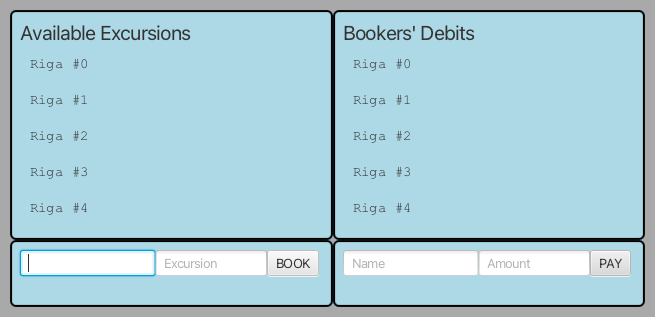
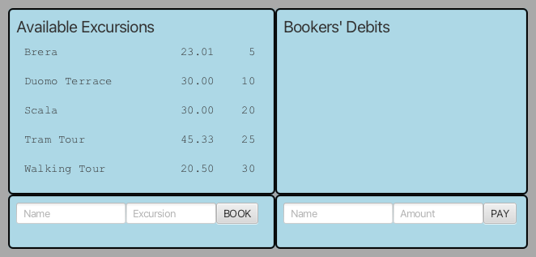
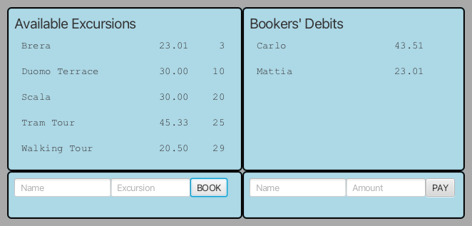
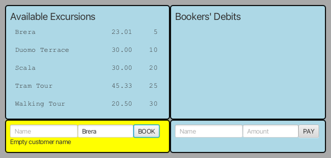

# CORSO INGEGNERIA DEL SOFTWARE A.A. 2023/24

## APPELLO DEL 17 LUGLIO 2024

* **Nome e cognome, matricola**:

Occorre effettuare il fork di questo repository e modificare questo README
inserendo l'anagrafica seguendo lo schema sopra riportato. Inoltre vanno
concessi i permessi di lettura ai docenti (`carlo.bellettini` e `mattia.monga`).

## PRENOTAZIONI E PAGAMENTI ESCURSIONI

Obiettivo dell'esercizio è progettare e realizzare un insieme di classi atte a
produrre un semplice programma Java che si occupi di permettere la prenotazione
e il pagamento delle escursioni. L'elenco delle escursioni è fornito in un file CSV
che contiene: `Nome dell'escursione, costo in EUR, posti disponibili`.

Vengono già fornite due classi *Viste* del sistema:

- [`InputConcreteView`](src/main/java/it/unimi/di/sweng/esame/view/InputConcreteView.java):
  che implementa l'interfaccia [`InputView`](src/main/java/it/unimi/di/sweng/esame/view/InputView.java) e nel Main viene istanziata due volte:
  - `inputBooking`: permette di immettere una prenotazione indicando il nome della persona e il nome della escursione da prenotare
  - `inputPayment`: permette di effettuare un pagamento indicando il nome della persona e l'ammontare da pagare

- [`DisplayView`](src/main/java/it/unimi/di/sweng/esame/view/DisplayView.java):
  che implementa l'interfaccia [`OutputView`](src/main/java/it/unimi/di/sweng/esame/view/OutputView.java) e nel Main viene istanziata due volte:
  - `excursions`: per visualizzare l'elenco delle escursioni ancora disponibili con prezzo e posti liberi (in ordine di posti liberi crescenti);
  - `debits`: per visualizzare l'elenco dei clienti che non hanno ancora saldato e l'ammontare di quanto ancora dovuto (in ordine di ammontare decrescente).

Viene fornita anche
- una prima versione della classe  [`Main`](src/main/java/it/unimi/di/sweng/esame/Main.java) che
permette d'istanziare la parte statica delle viste
- la prima parte di un metodo `readFile` della classe [`ModelState`](src/main/java/it/unimi/di/sweng/esame/model/ModelState.java) che il Main richiama per leggere un CSV file con i dati iniziali delle escursioni disponibili
- una interfaccia [`InputPresenter`](src/main/java/it/unimi/di/sweng/esame/presenter/InputPresenter.java)

**TUTTE LE CLASSI DATE POSSONO ESSERE DA VOI MODIFICATE (CANCELLATE, COMPLETATE) PER ADERIRE A VOSTRE IDEE DI
PROGETTAZIONE**

Lanciando il programma (tramite il task `run` di gradle) si ottiene una interfaccia simile a quella nella figura
sottostante **(le viste sono state adesso disposte in orizzontale per evitare problemi con schermi piccoli)**.

## TRACCIA

Completare, in modo da realizzare un'organizzazione del sistema di tipo
*Model-View-Presenter* e nel rispetto dei principi di buona progettazione (ad esempio quelli noti come SOLID), 
aggiungendo le classi necessarie in modo che
all'immissione di una nuova prenotazione o di un nuovo pagamento le viste si aggiornino coerentemente:

- La vista "Available Excursions" deve mostrare le escursioni disponibili in ordine decrescente di posti disponibili e in caso di parità in ordine alfabetico;
- La vista "Bookers' Debit" l'ammontare del debito di ciascun cliente che ha prenotato escursioni in ordine decrescente di cifra dovuta;
- Le escursioni senza posti disponibili non vengono mostrate
- I clienti che hanno pagato tutto il dovuto non vengono mostrati
- Un pagamento di una cifra superiore al debito deve essere rifiutato segnalando l'errore
- Un pagamento di una cifra inferiore al debito diminuisce il debito di tale cifra
- Non è possibile cancellare una prenotazione
- Nomi errati per le escursioni (vuoti, non esistenti o senza più posti) o per i debitori (vuoti o contenenti caratteri non alfabetici) vengono opportunamente segnalati

### Esempi di esecuzione

Il codice fornito include 3 _piccoli_ test di integrazione.

`testDisplayStartOK` controlla che all'inizio la situazione sia:

`testCorrectBookingInputSequence` controlla che dopo avere immesso le 3 prenotazioni (2 riferite alla stessa persona)
Carlo per Brera e Walking Tour, mentre Mattia per solo Brera, la situazione presentata sia:

`testInputBookingError`, con il suo primo (e al momento unico) caso di test, controlla che venga segnalato (tramite il metodo `showError`) 
il fatto che l'utente abbia lasciato vuoto il campo del nome del customer

### *Siete invitati a aggiungere altri test di integrazione utili a testare errori e scenari significativi*

### Processo

Una volta effettuato il **clone** del repository, il gruppo completa l'implementazione seguendo la *metodologia TDD*;
in maggior dettaglio, ripete i passi seguenti fino ad aver implementato tutte le funzionalità richieste:

* scelta la prossima funzionalità richiesta da implementare, inizia una feature di gitflow
* implementa un test per la funzionalità,
* verifica che **il codice compili correttamente**, ma l'**esecuzione del test fallisca**; solo a questo punto effettua
  un *commit*
  (usando `IntelliJ` o `git add` e `git commit`) iniziando il messaggio di commit con la stringa `ROSSO:`,
* aggiunge la minima implementazione necessaria a realizzare la funzionalità, in modo che **il test esegua con
  successo**; solo a questo punto
  effettua un *commit* (usando `IntelliJ` o `git add` e `git commit`) iniziando il messaggio di commit con la
  stringa `VERDE:`,
* procede, se necessario, al **refactoring** del codice, accertandosi che le modifiche non
  comportino il fallimento di alcun test; solo in questo caso fa seguire a ogni
  passo un *commit* (usando `IntelliJ` o `git add` e `git commit`)
  iniziando il messaggio di commit con la stringa `REFACTORING:`,
* ripete i passi precedenti fino a quando non considera la funzionalità realizzata nel suo complesso e allora chiude la
  feature di gitflow
* effettua un *push* dei passi svolti su `gitlab.di.unimi.it` con `IntelliJ` o`git push --all`.

### Testing

Mano a mano che si sviluppa il progetto, si deve controllare di mantenere una copertura, **sia dei comandi che delle
decisioni**, soddisfacente soprattutto per il codice rilaciato all'utente (se inferiore al 100% inserire un 
commento che spieghi perché non è possibile raggiungerlo o perché non lo ritenete necessario).

Sono presenti anche alcuni test di integrazione che (una volta completato nella inizializzazione) il progetto
alla fine "dovrebbe" passare. 

Ricordiamo che al fine del calcolo della copertura contano solo i test di unità e non quelli di integrazione.

### Consegna

Al termine del laboratorio dovete impacchettare l'**ultima versione stabile** come
una _release_ di gitflow chiamata "consegna" (usare esattamente questo nome) ed
effettuare un ultimo *push* di tutti i rami locali (**comprese eventuali feature
aperte ma non completate**); Ricordiamo che per i tag occorre un *push*
esplicito (`git push --tags`).

## **Verificate su `gitlab.di.unimi.it`** 

- che ci sia la completa traccia dei *commit* effettuati nei vari *branch*
- che il branch `main` punti all'ultima release chiusa
- che ci siano anche i *tag*
- di avere dato visibilità del vostro report ai due docenti con livello di visibilità _Reporter_ 

# Ricordiamo che è possibile consultare
- libri, appunti, sia cartacei che sul computer
- accedere a risorse internet

# Ma che verranno presi opportuni provvedimenti per coloro che
- comunicano con altre persone (sia in presenza che tramite computer). Quindi chiudete subito emails, telegram, slack, whatsapp, etc
- interrogano direttamente o indirettamente servizi basati su AI (tipo copilot, chatGPT, etc.). Quindi chiudete subito pagine web relative e disabilitate eventuali plugin.