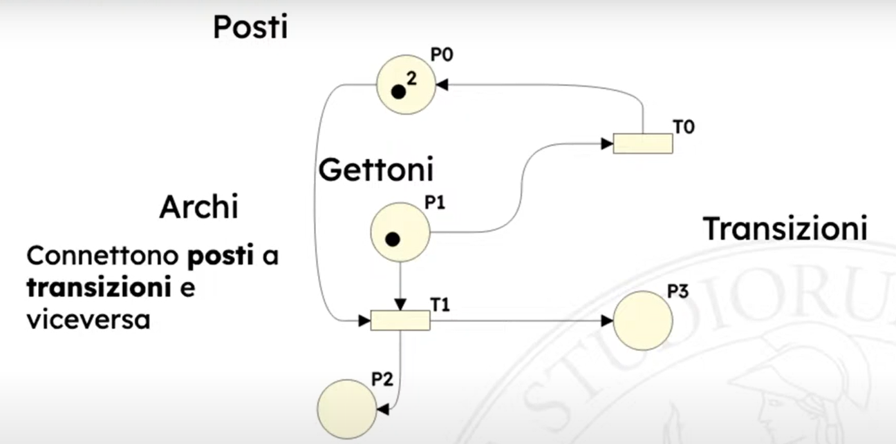
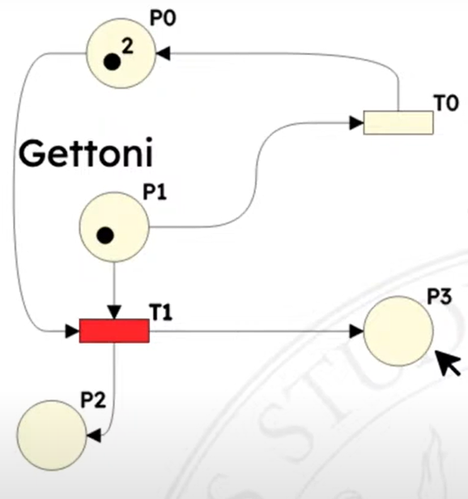
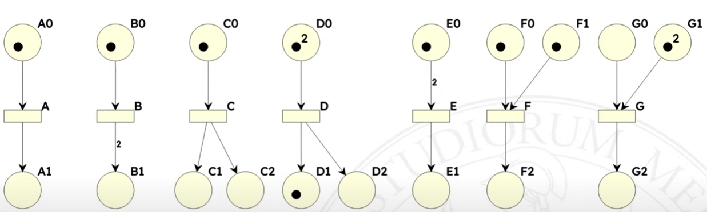
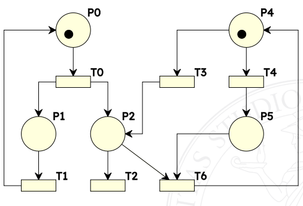
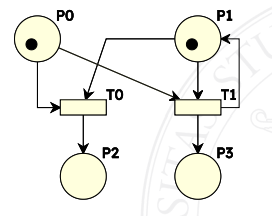
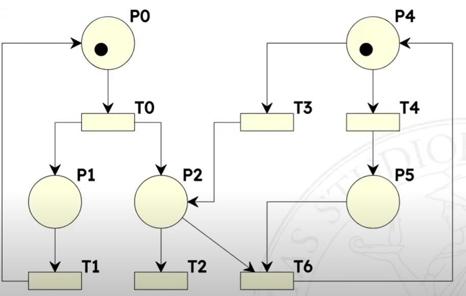
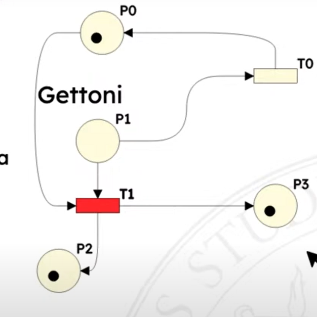
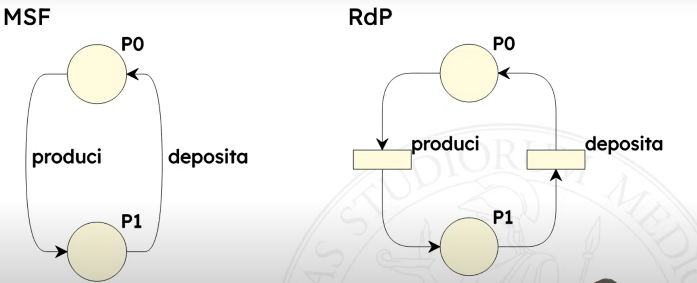

---
cssclasses:
  - cornell-note
tags:
  - petri
  - petri-nets
  - fsm
  - italian
---

Nascono per descrivere sistemi concorrenti.

# Note sulla sintassi

Marcatura: distribuzione dei token sui posti, piu' formalmente e' una funzione che assegna un intero non negativo ad ogni posto della rete
Scatto: $M[t_1 > M'$
$M$ abilita $t1$: $M[t_1 >$
I preset $pre(t)$ sono i posti connessi alle transizioni, i postset $pos(t)$ sono i posti connessi dalle transizioni.
# Differenza con FSM

* stato non e' a livello di sistema, ma come composizione di stati parziali
* transizioni sono promosse a nodi (non piu' archi), si limitano a modificare una parte dello stato globale

# Composte da 

* posti - cerchi
* token - assegnati a vari posti
* transizioni - rettangoli
* archi - connettono posti a transizioni, transizioni a posti

## Token

Posso assegnare piu' token per lo stesso posto, il numero di token puo' quindi rappresentare il numero di istanze di quel tipo di posto.

Ad esempio "tre robot che producono un certo manufatto".

Se non c'e' un limite imposto dalle logiche di transizione un posto puo' accettare infiniti token.
Cosa che con una FSM non posso modellare.

<aside>creazione e distruzione dei token</aside>
I token non si spostano! I token si creano e si distruggono!

## Transizioni

Collegati a certi eventi, scattano quando sussitono certe condizioni, se hanno abbastanza gettoni nei posti di ingresso

`T1` ha abbastanza token per scattare, i token finiscono nei posti in uscita

### Una transizione e' abilitata ad evolvere quando

$t \in T$ e' abilitata in $M$ se e solo se $\forall p \in pre(t) \qquad M(p) \ge W(\langle p, t \rangle)$

Lo scatto di una transizione $t$ in una marcatura $M$ produce una nuova marcatura $M'$.

Ci puo' essere una sola transizione alla volta. Se ci sono piu' transizioni abilitate non posso dire quale deve scattare, sono tutte equiprobabili.

#### Esempi di transizioni

Quali delle seguente sono abilitate ad evolvere? Vedi [Una transizione e' abilitata ad evolvere quando](Petri%20nets.md#Una%20transizione%20e'%20abilitata%20ad%20evolvere%20quando).

Discorsivamente: una transizione e' abilitata ad evolvere se il numero di token nei posti di input e' maggiore o uguale ai pesi degli archi connessi.

$A$ abilitata
$B$ abilitata
$C$ abilitata
$D$ abilitata
$E$ non abilitata
$F$ abilitata
$G$ non abilitata

Per le transizioni abilitate, quanti gettoni al primo posto e quanti al secondo?

$A$ 0 1
$B$ 0 2
$C$ 0 1 1 <= attenzione a questa!
$D$ 1 2 1
$F$ 0 0 1

### Sequenza

Una transizione $t_1$ e' in sequenza con una transizione $t_2$ in una marcatura $M$ se e solo se 

$M[t_1 > \land \lnot M[t_2 > \land M[t_1t_2 >$

O piu' umanamente:
* $t_1$ e' abilitata in $M$
* $t_2$ non e' abilitata in $M$
* $t_2$ e' abilitata nella marcatura $M'$ prodotta dallo scatto $M[t_1 > M'$

Nel seguente esempio $T0$ e $T1$, $T0$ e $T2$, $T3$ e $T2$

$T0$ e $T6$ no perche' $T6$ necessita di un token in $P5$, che manca.
$T1$ e $T0$ no perche' $T1$ non e' abilitata.

Nota che se una transizione e' in sequenza con un'altra dipende dalla situazione attuale.

### Conflitto

Due transizioni $t_1$ e $t_2$ sono in conflitto

* strutturale (dipende dalla topologia della rete non dalla marcatura) se e solo se $pre(t_1) \cap pre(t_2) \neq \emptyset$
* effettivo in una marcatura $M$ se e solo se:
    * riguardo il preset
        $M[T_{1} > \quad \land \quad M[t_{2} > \quad \land \ \exists p \in pre(t_{1}) \cap pre(t_{2}) \quad M(p) < W(\langle p,t_{1} \rangle) + W(\langle p,t_{2} \rangle)$
        "esiste un posto $p$ in ingresso a entrambe le transizioni che non ha abbastanza token per farle scattare entrambe
    * riguardo il postset
     $M[t_1> \land M[t_2 > \land \lnot M[t_{1}t_{2} >$

Conflitto effettivo condizione sufficiente perche' ci sia quello strutturale.

Le due transizioni sono in conflitto
* strutturale perche' hanno posti in comune
* effettivo perche' $P1$ non ha sufficenti gettoni per farle scattare entrambe, $P0$ si; basta che ce ne sia uno di posto che non riesce a soddisfare le esigenze. Se facessi scattare prima $T1$ non ci sarebbe il conflitto effettivo.

#### Esempio

Quali sono i conflitti qua?

* strutturali
    * $t_3$ e $t_4$
    * $t_2$ e $t_6$
* effettivi
    * $t_3$ e $t_4$

### Concorrenza

Due transizioni $t_1$ e $t_2$ sono in concorrenza
    * strutturale se e solo se
    $pre(t_1) \cap pre(t_2) = \emptyset$
    (la negazione del conflitto)
    * effettiva in una marcatura $M$ se e solo se
        * riguardo il preset
        $M[T_{1} > \quad \land \quad M[t_{2} > \quad \land \ \forall p \in pre(t_{1}) \cap pre(t_{2}) \quad M(p) \geq W(\langle p,t_{1} \rangle) + W(\langle p,t_{2} \rangle)$
        "tutti i posti in ingresso a entrambe le transizioni hanno abbastanza token per farle scattare entrambe

## Archi

Possono avere un peso, quindi posso esprimere situazioni concorrenti. Se non scrivo nulla vuol dire peso 1.

Un arco in entrata di una transizione, e' un requirement.
Un arco in uscita da una transizione, crea dei token.

# Definizione formale

E' una 5-upla $[P, T; F, W, M_{0}]$

* $P$ insieme dei posti
* $T$ insieme delle transizioni
* $F$ relazione di flusso - $F \subseteq (P \times T) \cup (T \times P)$
* $W$ la funzione peso (codominio senza $0$) - $W : F \rightarrow \\N^{+}$
* $M_{0}$ la funzione marcatura (iniziale) - $M_0 : P \rightarrow \\N$

$P \cup T$ non puo' essere vuoto
$P \cap T$ e' vuoto

$pre(a) = { d \in (P \cup T) \ | \ \langle d,a \rangle \in F }$
$post(a) = { d \in (P \cup T) \ | \ \langle a,d \rangle \in F }$

Quindi i preset sono i posti connessi alle transizioni, i postset sono i posti connessi dalle transizioni.

## Definizione di $M'$

Notazione: $\forall p \in pre(t) \setminus post(t)$ significa "per tutti i posti che appartengono al preset di $t$ ma non appartengono al postset di $t$"

$W(\langle p,t \rangle)$ numero di gettoni nell'arco

$$
\begin{align}
&\forall p \in pre(t) \setminus post(t) &\qquad M'(p) &= M(p) - W(\langle p,t \rangle) \\
&\forall p \in post(t) \setminus pre(t) &\qquad M'(p) &= M(p) + W(\langle t,p \rangle) \\
&\forall p \in post(t) \cap pre(t) &\qquad M'(p) &= M(p) - W(\langle p,t \rangle) + W(\langle t,p \rangle) \\
&\forall p \in P \setminus (pre(t) \cup post(t)) &\qquad M'(p) &= M(p)
\end{align}
$$

Grazie all'ultima e' possibile fare una analisi locale.

# Esempio

