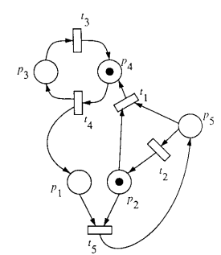

---
tags:
  - petri
  - petri-nets
  - fsm
  - italian
---

Nascono per descrivere sistemi concorrenti.

## Definizione informale

Sono composte da

* posti - cerchi - di solito vengono usati nomi per descriverli
* token - assegnati a vari posti
* transizioni - rettangoli - di solito verbi che modificano lo stato
* archi - connettono posti a transizioni, transizioni a posti

<figure> <a href="https://homes.di.unimi.it/bellettini/pnexec/index2.html?pn=%28LettorePronto%29%20700%2C0%0A_LettoreInizia_%201100%2C0%0A%28Biblioteca%29%201500%2C200%0A_ScrittoreInizia_%201900%2C0%0A%28ScrittorePronto%29%202300%2C0%0A%28LettoreLegge%29%201200%2C500%0A%28ScrittoreScrive%29%201800%2C500%0A_LettoreFinisce_%201200%2C800%0A_ScrittoreFinisce_%201800%2C800%0ALettorePronto%20-%3E%20LettoreInizia%0ALettoreInizia%20-%3E%20LettoreLegge%0ABiblioteca%20-%3E%20LettoreInizia%0ALettoreLegge%20-%3E%20LettoreFinisce%0ALettoreFinisce%20-%3E%20Biblioteca%0ALettoreFinisce%20-%3E%20LettorePronto%0AScrittorePronto%20-%3E%20ScrittoreInizia%0AScrittoreInizia%20-%3E%20ScrittoreScrive%0ABiblioteca%20-4%3E%20ScrittoreInizia%0AScrittoreScrive%20-%3E%20ScrittoreFinisce%0AScrittoreFinisce%20-4%3E%20Biblioteca%0AScrittoreFinisce%20-%3E%20ScrittorePronto%0A%40LettorePronto%3A4%0A%40Biblioteca%3A4%0A%40ScrittorePronto%3A2">  </a> <figcaption>Un esempio di Rete di Petri</figcaption> </figure>

## Token

Posso assegnare più token per lo stesso posto, il numero di token può quindi rappresentare il numero di istanze di quel tipo di posto <label class="sidenote-toggle sidenote-number"></label>. 
I token non si spostano, i token si creano e si distruggono!

Ad esempio "tre robot che producono un certo manufatto".

Se non c'e' un limite imposto dalle logiche di transizione un posto può accettare infiniti token.
Cosa che con una FSM non posso modellare.

## Stato

Non e' visto a livello di sistema ma come composizione di tanti stati parziali 

<figure> <a href="https://homes.di.unimi.it/bellettini/pnexec/index2.html?pn=%28LettorePronto%29%20700%2C0%0A_LettoreInizia_%201100%2C0%0A%28Biblioteca%29%201500%2C200%0A_ScrittoreInizia_%201900%2C0%0A%28ScrittorePronto%29%202300%2C0%0A%28LettoreLegge%29%201200%2C500%0A%28ScrittoreScrive%29%201800%2C500%0A_LettoreFinisce_%201200%2C800%0A_ScrittoreFinisce_%201800%2C800%0ALettorePronto%20-%3E%20LettoreInizia%0ALettoreInizia%20-%3E%20LettoreLegge%0ABiblioteca%20-%3E%20LettoreInizia%0ALettoreLegge%20-%3E%20LettoreFinisce%0ALettoreFinisce%20-%3E%20Biblioteca%0ALettoreFinisce%20-%3E%20LettorePronto%0AScrittorePronto%20-%3E%20ScrittoreInizia%0AScrittoreInizia%20-%3E%20ScrittoreScrive%0ABiblioteca%20-4%3E%20ScrittoreInizia%0AScrittoreScrive%20-%3E%20ScrittoreFinisce%0AScrittoreFinisce%20-4%3E%20Biblioteca%0AScrittoreFinisce%20-%3E%20ScrittorePronto%0A%40LettorePronto%3A4%0A%40Biblioteca%3A4%0A%40ScrittorePronto%3A2">  </a> <figcaption>Una rete di Petri e' in grado di rappresentare infiniti stati</figcaption> </figure>

### Differenza con FSM

* stato non e' a livello di sistema, ma come composizione di stati parziali
* transizioni sono promosse a nodi (non più archi), si limitano a modificare una parte dello stato globale

## Archi

Possono avere un peso, quindi posso esprimere situazioni concorrenti. Se non scrivo nulla vuol dire peso 1.

Un arco in entrata di una transizione, e' un requirement.
Un arco in uscita da una transizione, crea dei token.

# Note sulla sintassi

Marcatura: distribuzione dei token sui posti, più formalmente e' una funzione che assegna un intero non negativo ad ogni posto della rete.\
$M(p)$: numero di gettoni in Posto $p$ per Marcatura $M$\
Scatto: $M[t_1 > M'$\
$M$ abilita $t1$: $M[t_1 >$\
I pre-set $pre(t)$ sono i posti connessi alle transizioni, i post-set $pos(t)$ sono i posti connessi dalle transizioni.

## Definizione formale

E' una 5-upla $[P, T; F, W, M_{0}]$

* $P$ insieme dei posti
* $T$ insieme delle transizioni
* $F$ relazione di flusso - $F \subseteq (P \times T) \cup (T \times P)$, mette in relazione un posto con una transizione o una transizione con un posto
* $W$ la funzione peso (codominio senza $0$) - $W : F \rightarrow \\N^{+}$
* $M_{0}$ la funzione marcatura (iniziale) - $M_0 : P \rightarrow \\N$

Un identificatore o identifica un posto, o identifica una transizione.

$P \cup T$ non può essere vuoto
$P \cap T$ e' vuoto

$pre(a) = { d \in (P \cup T) \ | \ \langle d,a \rangle \in F }$
$post(a) = { d \in (P \cup T) \ | \ \langle a,d \rangle \in F }$

Quindi i pre-set sono i posti connessi alle transizioni, i post-set sono i posti connessi dalle transizioni.

## Transizioni

Collegati a certi eventi, scattano quando sussistono certe condizioni, se hanno abbastanza gettoni nei posti di ingresso.

### Una transizione e' abilitata ad evolvere quando

$t \in T$ e' abilitata in $M$ se e solo se $\forall p \in pre(t) \qquad M(p) \ge W(\langle p, t \rangle)$

Una transizione che non ha un posto prima di essa e' abilitata a scattare.\
Lo scatto di una transizione $t$ in una marcatura $M$ produce una nuova marcatura $M'$.

Ci può essere una sola transizione alla volta. Se ci sono più transizioni abilitate non posso dire quale deve scattare, sono tutte equiprobabili (non determinismo).

Scrivo $M[t>$ e dico che $t$ e' abilitata in $M$.

### Risultati di uno scatto

Lo scatto di una transizione $t$ in una marcatura $M$ produce una nuova marcatura $M'$: $M[t>M'$

Notazione: $\forall p \in pre(t) \setminus post(t)$ significa "per tutti i posti che appartengono al pre-set di $t$ ma non appartengono al post-set di $t$"

$W(\langle p,t \rangle)$ numero di gettoni nell'arco

$$
\begin{align}
&\forall p \in pre(t) \setminus post(t) &\qquad M'(p) &= M(p) - W(\langle p,t \rangle) \\
&\forall p \in post(t) \setminus pre(t) &\qquad M'(p) &= M(p) + W(\langle t,p \rangle) \\
&\forall p \in post(t) \cap pre(t) &\qquad M'(p) &= M(p) - W(\langle p,t \rangle) + W(\langle t,p \rangle) \\
&\forall p \in P \setminus (pre(t) \cup post(t)) &\qquad M'(p) &= M(p)
\end{align}
$$

Grazie all'ultima e' possibile fare una analisi locale. Non ho bisogno di guardare tutto il sistema <label class="sidenote-toggle sidenote-number"></label>.Passaggio fondamentale delle Reti di Petri

#### Esempi di transizioni

Discorsivamente: una transizione e' abilitata ad evolvere se il numero di token nei posti di input e' maggiore o uguale ai pesi degli archi connessi.

Sono abilitate: $A$, $B$, $C$, $D$, $F$; per capire quando una transizione e' abilitata a scattare basta ricordarsi che $\forall p \in Pre(t) \qquad M(p) \geq W(\langle p,t \rangle)$

### Relazione di sequenza

Una transizione $t_1$ e' in sequenza con una transizione $t_2$ in una marcatura $M$ se e solo se 

$M[t_1> \quad \land \quad \lnot M[t_2> \quad \land \quad M[t_1t_2>$

O più umanamente:

* $t_1$ e' abilitata in $M$
* $t_2$ non e' abilitata in $M$
* $t_2$ e' abilitata nella marcatura $M'$ prodotta dallo scatto $M[t_1> M'$

Nel seguente esempio $T0$ e $T1$, $T0$ e $T2$, $T3$ e $T2$

$T0$ e $T6$ no perche' $T6$ necessita di un token in $P5$, che manca.
$T1$ e $T0$ no perche' $T1$ non e' abilitata.

Nota che se una transizione e' in sequenza con un'altra dipende dalla situazione attuale.

### Relazione di conflitto

#### Strutturale

Dipende dalla topologia della rete non dalla marcatura, se e solo se $pre(t_1) \cap pre(t_2) \neq \emptyset$

#### Effettivo

Sebbene le due transizioni possano scattare individualmente in $M$ (sono entrambe abilitate), c'e' un problema se tentano di scattare simultaneamente o in immediata successione.

Ho conflitto effettivo in una marcatura $M$ se e solo se:

* riguardo il pre-set
	$M[T_{1} > \quad \land \quad M[t_{2} > \quad \land \ \exists p \in pre(t_{1}) \cap pre(t_{2}) \quad M(p) < W(\langle p,t_{1} \rangle) + W(\langle p,t_{2} \rangle)$
	"esiste un posto $p$ in ingresso a entrambe le transizioni che non ha abbastanza token per farle scattare entrambe"
* riguardo il post-set
  $M[t_1> \land M[t_2 > \land \lnot M[t_{1}t_{2} >$

Conflitto effettivo condizione sufficiente perché ci sia quello strutturale.\
Conflitto strutturale condizione necessaria perché ci sia quello effettivo.

Le due transizioni sono in conflitto

* strutturale perché hanno posti in comune
* effettivo perché $P1$ non ha sufficienti gettoni per farle scattare entrambe, $P0$ si; basta che ce ne sia uno di posto che non riesce a soddisfare le esigenze. Se facessi scattare prima $T1$ non ci sarebbe il conflitto effettivo.

E' possibile far scattare due transizioni assieme, purché ci siano sufficienti token.

#### Esempio di conflitti

Quali sono i conflitti qua?

* strutturali
    * $t_3$ e $t_4$
    * $t_2$ e $t_6$
* effettivi
    * $t_3$ e $t_4$

### Relazione di concorrenza

La si può pensare come la relazione opposta alla relazione di conflitto.\
Concorrenza strutturale implica concorrenza effettiva, se sono abilitate le transizioni.\

#### Strutturale

Se e solo se $pre(t_1) \cap pre(t_2) = \emptyset$ (la negazione del conflitto)

#### Effettiva

Se e solo se $M[T_{1} > \quad \land \quad M[t_{2} > \quad \land \ \forall p \in pre(t_{1}) \cap pre(t_{2}) \quad M(p) \geq W(\langle p,t_{1} \rangle) + W(\langle p,t_{2} \rangle)$ 
 
Vale a dire: "tutti i posti in ingresso a entrambe le transizioni hanno abbastanza token per farle scattare entrambe"

# Insieme di raggiungibilita'

$R$ e' l'insieme di raggiungibilita', che e' il piu' piccolo insieme di marcature tale che:

* $M \in R(P/T, M)$  
<label for="sn-3" class="sidenote-toggle sidenote-number"></label>
$P/T$ sono le Reti di Petri fin qua viste (Posti Transizioni)
* $(M' \in R(P/T, M) \  \land \ \exists t \in T \ M'[t> M'') \implies M'' \in R(P/T, M)$

Tutte le marcature raggiungibili da una corretta play della Rete di Petri.

# Proprieta' di limitatezza

$P/T$ con Marcatura $M$ si dice limitata se e solo se 

$\exists k \in \mathbb{N} \quad \forall M' \in R(P/T, M) \ \forall p \in P \quad M'(p) \le k$

Cioe' se riesco a fissare un numero massimo di Token per ognuno dei Posti.
La cardinalita' dell'insieme di raggiungibilita' e' infinito oppure no?

## Legame con automi a stati finiti

Se la rete di Petri e' limitata, allora l'insieme di raggiungibilita' finito, allora esiste un automa a stati finiti corrispondente che ne descrive il comportamento.

Gli stati sono le possibili marcature dell'insieme di raggiungibilita'.

# Vitalita' di una transizione

Una transizione $t$ in una Marcatura $M$ si dice viva.

Una rete si dice viva se tutte le sue transizioni sono vive.

## Grado 0 - morta

Non e' abilitata in $M$ e in nessuna delle Marcature raggiungibili da $M$ allora 

$$\forall M' \in R(P/T, M) \quad \lnot M'[t>$$

Non sono piu' capace di far scattare una transizione.

Esempio: se c'e' una transizione che rappresenta lo scoppio di una centrale nucleare, il fatto che la transizione sia dimostrabile che e' morta e' una cosa molto piacevole. La centrale non puo' esplodere per il motivo rappresentato dalla transizione.

## Grado 1

Esiste almeno una Marcatura raggiungibile da $M$ in cui $t$ e' abilitata

$\exists M' \in R(P/T, M) \quad M[t>$

Posso essere in grado di spegnere la centrale nucleare in maniera sicura.

## Grado 2

Per ogni numero $k$ (quindi grande a piacere) esiste almeno una sequenza di scatti ammissibile da $M$ in cui la transizione $t$ scatta $k$ volte

$\forall k \in \mathbb{N} \quad M[..t\ ..t^1 \ ..t^{k-1} \ ..t^k>$

## Grado 3

Esiste almeno una sequenza ammissibile da $M$ in cui la transizione $t$ scatta infinite volte.

## Grado 4 - viva

In qualunque Marcatura raggiungibile da $M$, $t$ non e' morta

$\forall M' \in R(P/T, M) \quad \exists M'' \in R(P/T, M') \quad M''[t>$

## Esempi

<iframe src="iframes/petri/unbounded-with-dead.html" width="100%" height="500px"></iframe>
<figcaption>$t1$ e' una transizione morta, $p1$ e' un posto non limitato</figcaption>

<figcaption>$t1$ e' una transizione morta perche' $p2$ per poter avere un token deve riceverlo da $p5$ ma allora $p5$ rimane senza, $p1$ e' un posto non limitato perche' posso continuamente far scattare $t4$</figcaption>

$T0$ Morta
$T1$ Grado 1
{width=300px}

$T3$ Grado 3
{width=300px}

$T2$ Grado 2, perche' posso farla scattare quante volte voglio, ma ad un certo punto devo fermarmi: non va avanti da sola
{width=300px}

# Estensioni

## Capacita' dei posti

Posso fissare un massimo numero di Token ammissibili per un Posto.
La regola di abilitazione cambia con una aggiunta:

* $\forall p \in pre(t) \qquad M(p) \ge W(\langle p, t \rangle)$ (preesistente)
* $\forall p \in post(t) \qquad M(p) + W(\langle t,p \rangle) \le K(p)$

Dove $K(p)$ e' la capacita' di $p$.

## Posto complementare

Un posto $p_c$ si dice complementare rispetto ad un posto $p$ quando ha archi di pari peso verso le stesse transizioni di $p$, ma con verso opposto. 

Grazie ai posti complementari "reti con capacita' di posti possono essere tradotte in rete senza capacita' di posti" senza complicare troppo la cosa.

$\forall t \in pre(p) \quad \exists \langle p_{c}, t \rangle \in F \quad W(\langle p_{c},t \rangle) = W(\langle t,p \rangle)$

$\forall t \in post(p) \quad \exists \langle t,p_{c} \rangle \in F \quad W(\langle t, p_{c} \rangle) = W(\langle p,t \rangle)$

Algoritmo per l'introduzione di un posto complementare:

* aggiungere il posto complementare (o piu' di uno come nell'esempio)
* la marcatura iniziale e' (ad esempio per $p_1$) $M'_0(p'_1) = K(p_1) - M_0(p_1) = 2 - 1 = 1$
* si aggiungono gli archi verso le direzioni opposte nelle transizioni interessate

## Archi inibitori

A differenza dei normali archi, gli archi inibitori richiedono la mancanza di gettoni in un posto perche' la transizione sia abilitata.

In caso di rete limitata la potenza espressiva di una rete che sfrutta gli archi inibitori non cambia, perche' esistendo un limite massimo di gettoni $k$ all'interno della rete e' sufficiente creare un posto complementare a $p$ detto $p_c$ tale che 

$$M(p) + M(p_c) < k $$

# Rete pura

Una rete e' detta pura se $\forall t \in T \quad pre(t) \cap post(t) = \emptyset$

Il vantaggio di una rete pura e' la semplicita' di lettura che si ottiene, perche' non avendo archi da e verso la stessa transizione viene piu' semplice ragionare

* su regole di scatto
* sull'ambiguita' di cio' che si sta osservando
* ci sono problemi nell'implementazione di archi inibitori

Nel caso di un rete non pura la regola per lo scatto di una transizione cambia: devono essere considerati anche i posti nel postset che sono anche nel preset.

# Eliminare i pesi degli archi

Per semplificare la rete.

Creo un nuovo Posto e una nuova Transizione. 

{width=300px}

ESPANDERE Boh? Non ho capito nulla.

E S P A N D E R E

# Albero di raggiungibilita'

"Come faccio a verificare se le proprieta' che desidero siano verificate?"
"Genero l'albero di raggiungibilita'"

## Algoritmo per la generazione

ESPANERE

# Copribilita'

Una Marcatura $M$ copre una Marcatura $M'$ ($M'$ e' coperta da $M$) se e solo se: $\forall p \in P \quad M(p) \ge M'(p)$

Una Marcatura $M$ e' detta copribile a partire da una marcatura $M'$ se esiste una marcatura $M'' \in R(P/T, M')$ che copre $M$.

"Ho piu' gettoni posto per posto".
Copre in maniera propria se $M(p) \gt M'(p)$

E' utile perche' se $M$ e' la marcatura minima per abilitare $t$

$\forall p \in pre(t) \quad M(p) = W(\langle p,t \rangle)$ e $\forall p \in P \setminus pre(t) \quad M(p) = 0$

allora la transizione $t$ e' morta se e solo se $M$ non e' copribile a partire dalla Marcatura corrente.
