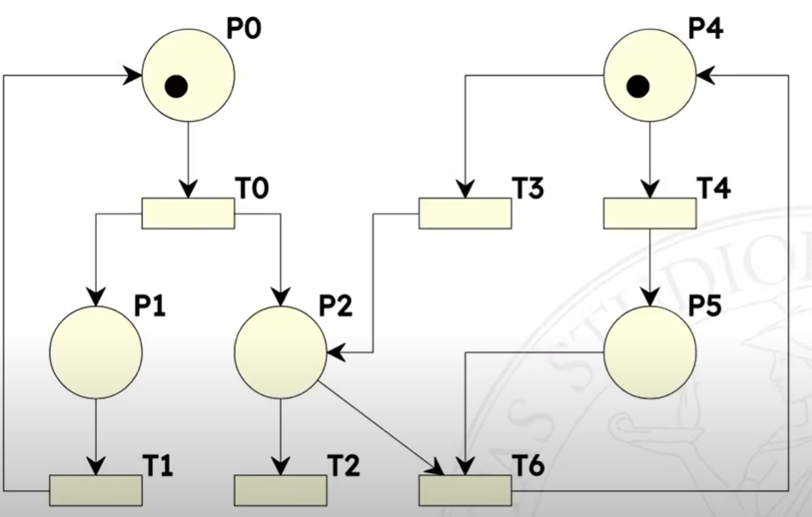

---
tags:
  - petri
  - petri-nets
  - fsm
  - italian
---

```table-of-contents style:nestedOrderedList
```

Nascono per descrivere sistemi concorrenti.

## Perché' studiamo le Reti di Petri?

La comprensione di un sistema può migliorare, lo esprimo con le Reti di Petri:

* descrivo ciò' che voglio che accada
* verifico che quella proprietà accada

Scrivo specifiche in modo più chiaro, controllo che siano corrette. Molto spesso gli errori sono nelle specifiche, perdo dei particolari.

Non si parla di garantire che il codice sia corretto.

## Definizione informale

Sono composte da

* posti - cerchi - di solito vengono usati nomi per descriverli
* token - assegnati a vari posti
* transizioni - rettangoli - di solito verbi che modificano lo stato
* archi - connettono posti a transizioni, transizioni a posti

<figure> <a href="https://homes.di.unimi.it/bellettini/pnexec/index2.html?pn=%28LettorePronto%29%20700%2C0%0A_LettoreInizia_%201100%2C0%0A%28Biblioteca%29%201500%2C200%0A_ScrittoreInizia_%201900%2C0%0A%28ScrittorePronto%29%202300%2C0%0A%28LettoreLegge%29%201200%2C500%0A%28ScrittoreScrive%29%201800%2C500%0A_LettoreFinisce_%201200%2C800%0A_ScrittoreFinisce_%201800%2C800%0ALettorePronto%20-%3E%20LettoreInizia%0ALettoreInizia%20-%3E%20LettoreLegge%0ABiblioteca%20-%3E%20LettoreInizia%0ALettoreLegge%20-%3E%20LettoreFinisce%0ALettoreFinisce%20-%3E%20Biblioteca%0ALettoreFinisce%20-%3E%20LettorePronto%0AScrittorePronto%20-%3E%20ScrittoreInizia%0AScrittoreInizia%20-%3E%20ScrittoreScrive%0ABiblioteca%20-4%3E%20ScrittoreInizia%0AScrittoreScrive%20-%3E%20ScrittoreFinisce%0AScrittoreFinisce%20-4%3E%20Biblioteca%0AScrittoreFinisce%20-%3E%20ScrittorePronto%0A%40LettorePronto%3A4%0A%40Biblioteca%3A4%0A%40ScrittorePronto%3A2">  </a> <figcaption>Un esempio di Rete di Petri</figcaption> </figure>

## Token

Posso assegnare più token per lo stesso posto, il numero di token può quindi rappresentare il numero di istanze di quel tipo di posto <label class="sidenote-toggle sidenote-number"></label>. 
<span class="sidenote">I token non si spostano, i token si creano e si distruggono!</span>

Ad esempio "tre robot che producono un certo manufatto".

Se non c'e' un limite imposto dalle logiche di transizione un posto può accettare infiniti token.
Cosa che con una FSM non posso modellare.

## Stato

Non e' visto a livello di sistema ma come composizione di tanti stati parziali 

<figure> <figcaption>Una rete di Petri e' in grado di rappresentare infiniti stati</figcaption> </figure>

### Differenza con FSM

* stato non e' a livello di sistema, ma come composizione di stati parziali
* transizioni sono promosse a nodi (non più archi), si limitano a modificare una parte dello stato globale

## Archi

Possono avere un peso, quindi posso esprimere situazioni concorrenti. Se non scrivo nulla vuol dire peso 1.

Un arco <span class="b">in entrata</span> di una transizione, e' un <span class="b">requirement</span>.
Un arco <span class="b">in uscita</span> da una transizione, crea dei token.


## Note sulla sintassi

Marcatura: distribuzione dei token sui posti, più formalmente e' una funzione che assegna un intero non negativo ad ogni posto della rete.\
$M(p)$: numero di gettoni in Posto $p$ per Marcatura $M$\
Scatto: $M[t_1 > M'$\
$M$ abilita $t1$: $M[t_1 >$\
I pre-set $pre(t)$ sono i posti connessi alle transizioni, i post-set $pos(t)$ sono i posti connessi dalle transizioni.


## Nota sulla località

I vantaggi di avere questa proprietà sono:

* possibilità di avere multi-threading
* maggiore chiarezza nel comprendere o modificare una rete, perché non devo considerare il tutto, ma solo una porzione

## Definizione formale

E' una 5-upla $[P, T; F, W, M_{0}]$

* $P$ insieme dei posti
* $T$ insieme delle transizioni
* $F$ relazione di flusso - $F \subseteq (P \times T) \cup (T \times P)$, mette in relazione un posto con una transizione o una transizione con un posto
* $W$ la funzione peso (codominio senza $0$) - $W : F \rightarrow \\N^{+}$
* $M_{0}$ la funzione marcatura (iniziale) - $M_0 : P \rightarrow \\N$

Un identificatore o identifica un posto, o identifica una transizione.

$P \cup T$ non può essere vuoto
$P \cap T$ e' vuoto

$pre(a) = { d \in (P \cup T) \ | \ \langle d,a \rangle \in F }$
$post(a) = { d \in (P \cup T) \ | \ \langle a,d \rangle \in F }$

Quindi i pre-set sono i posti connessi alle transizioni, i post-set sono i posti connessi dalle transizioni.

## Transizioni

Collegati a certi eventi, scattano quando sussistono certe condizioni, se hanno abbastanza gettoni nei posti di ingresso.

### Una transizione e' abilitata ad evolvere quando

$t \in T$ e' abilitata in $M$ se e solo se $\forall p \in pre(t) \qquad M(p) \ge W(\langle p, t \rangle)$

Una transizione che non ha un posto prima di essa e' abilitata a scattare.\
Lo scatto di una transizione $t$ in una marcatura $M$ produce una nuova marcatura $M'$.

Ci può essere una sola transizione alla volta. Se ci sono più transizioni abilitate non posso dire quale deve scattare, sono tutte equiprobabili (non determinismo).

Scrivo $M[t>$ e dico che $t$ e' abilitata in $M$.

### Risultati di uno scatto

Lo scatto di una transizione $t$ in una marcatura $M$ produce una nuova marcatura $M'$: $M[t>M'$

Notazione: $\forall p \in pre(t) \setminus post(t)$ significa "per tutti i posti che appartengono al pre-set di $t$ ma non appartengono al post-set di $t$"

$W(\langle p,t \rangle)$ numero di gettoni nell'arco

$$
\begin{align}
&\forall p \in pre(t) \setminus post(t) &\qquad M'(p) &= M(p) - W(\langle p,t \rangle) \\
&\forall p \in post(t) \setminus pre(t) &\qquad M'(p) &= M(p) + W(\langle t,p \rangle) \\
&\forall p \in post(t) \cap pre(t) &\qquad M'(p) &= M(p) - W(\langle p,t \rangle) + W(\langle t,p \rangle) \\
&\forall p \in P \setminus (pre(t) \cup post(t)) &\qquad M'(p) &= M(p)
\end{align}
$$

Grazie all'ultima e' possibile fare una analisi locale. Non ho bisogno di guardare tutto il sistema <label class="sidenote-toggle sidenote-number"></label>.<span class="sidenote">Passaggio fondamentale delle Reti di Petri</span>

#### Esempi di transizioni

Discorsivamente: una transizione e' abilitata ad evolvere se il numero di token nei posti di input e' maggiore o uguale ai pesi degli archi connessi.


Sono abilitate: $A$, $B$, $C$, $D$, $F$; per capire quando una transizione e' abilitata a scattare basta ricordarsi che $\forall p \in Pre(t) \qquad M(p) \geq W(\langle p,t \rangle)$

### Relazione di sequenza

Una transizione $t_1$ e' in sequenza con una transizione $t_2$ in una marcatura $M$ se e solo se 

$M[t_1> \quad \land \quad \lnot M[t_2> \quad \land \quad M[t_1t_2>$

O più umanamente:

* $t_1$ e' abilitata in $M$
* $t_2$ non e' abilitata in $M$
* $t_2$ e' abilitata nella marcatura $M'$ prodotta dallo scatto $M[t_1> M'$

Nel seguente esempio $T0$ e $T1$, $T0$ e $T2$, $T3$ e $T2$


$T0$ e $T6$ no perche' $T6$ necessita di un token in $P5$, che manca.
$T1$ e $T0$ no perche' $T1$ non e' abilitata.

Nota che se una transizione e' in sequenza con un'altra dipende dalla situazione attuale.

### Relazione di conflitto

#### Strutturale

Dipende dalla topologia della rete non dalla marcatura, se e solo se $pre(t_1) \cap pre(t_2) \neq \emptyset$

#### Effettivo

Sebbene le due transizioni possano scattare individualmente in $M$ (sono entrambe abilitate), c'e' un problema se tentano di scattare simultaneamente o in immediata successione.

Ho conflitto effettivo in una marcatura $M$ se e solo se:

* riguardo il pre-set
	$M[T_{1} > \quad \land \quad M[t_{2} > \quad \land \ \exists p \in pre(t_{1}) \cap pre(t_{2}) \quad M(p) < W(\langle p,t_{1} \rangle) + W(\langle p,t_{2} \rangle)$
	"esiste un posto $p$ in ingresso a entrambe le transizioni che non ha abbastanza token per farle scattare entrambe"
* riguardo il post-set
  $M[t_1> \land M[t_2 > \land \lnot M[t_{1}t_{2} >$


Conflitto effettivo condizione sufficiente perché ci sia quello strutturale.\
Conflitto strutturale condizione necessaria perché ci sia quello effettivo.

Le due transizioni sono in conflitto

* strutturale perché hanno posti in comune
* effettivo perché $P1$ non ha sufficienti gettoni per farle scattare entrambe, $P0$ si; basta che ce ne sia uno di posto che non riesce a soddisfare le esigenze. Se facessi scattare prima $T1$ non ci sarebbe il conflitto effettivo.

E' possibile far scattare due transizioni assieme, purché ci siano sufficienti token.

#### Esempio di conflitti

Quali sono i conflitti qua?



* strutturali
    * $t_3$ e $t_4$
    * $t_2$ e $t_6$
* effettivi
    * $t_3$ e $t_4$

### Relazione di concorrenza

La si può pensare come la relazione opposta alla relazione di conflitto.\
Concorrenza strutturale implica concorrenza effettiva, se sono abilitate le transizioni.\

#### Strutturale

Se e solo se $pre(t_1) \cap pre(t_2) = \emptyset$ (la negazione del conflitto)

#### Effettiva

Se e solo se $M[T_{1} > \quad \land \quad M[t_{2} > \quad \land \ \forall p \in pre(t_{1}) \cap pre(t_{2}) \quad M(p) \geq W(\langle p,t_{1} \rangle) + W(\langle p,t_{2} \rangle)$ 
 
Vale a dire: "tutti i posti in ingresso a entrambe le transizioni hanno abbastanza token per farle scattare entrambe"

## Insieme di raggiungibilità

$R$ e' l'insieme di raggiungibilità, che e' il più piccolo insieme di marcature tale che:

* $M \in R(P/T, M)$  
<label for="sn-3" class="sidenote-toggle sidenote-number"></label>
<span class="sidenote">$P/T$ sono le Reti di Petri fin qua viste (Posti Transizioni)</span>

* $(M' \in R(P/T, M) \  \land \ \exists t \in T \ M'[t> M'') \implies M'' \in R(P/T, M)$

Tutte le marcature raggiungibili da una corretta play della Rete di Petri.

## Proprietà di limitatezza

$P/T$ con Marcatura $M$ si dice limitata se e solo se 

$\exists k \in \mathbb{N} \quad \forall M' \in R(P/T, M) \ \forall p \in P \quad M'(p) \le k$

Cioè se riesco a fissare un numero massimo di token per ognuno dei posti.

<figure> <a href="https://homes.di.unimi.it/bellettini/pnexec/index2.html?pn=%28P0%29%20200%2C0%0A%28P1%29%20600%2C0%0A_T0_%20400%2C0%0A%0AP0%20-%3E%20T0%0AT0%20-%3E%20P0%0AT0%20-%3E%20P1%0A%0A%40P0%3A1">  </a> <figcaption>Esempio di rete illimitata</figcaption> </figure>

Dal momento che $T0$ può scattare indefinitamente e aggiungere continuamente token in $P1$ il numero di token in $P1$ può crescere senza limiti.

La seguente invece non e' illimitata, ho sempre un solo token, a prescindere dal fatto che ci sia un ciclo infinito.

<figure> <a href="https://homes.di.unimi.it/bellettini/pnexec/index2.html?pn=%28P0%29%20200%2C0%0A%28P1%29%20600%2C0%0A_T1_%20400%2C200%0A_T0_%20400%2C0%0A%0AP0%20-%3E%20T0%0AT0%20-%3E%20P1%0AP1%20-%3E%20T1%0AT1%20-%3E%20P0%0A%0A%40P0%3A1">  </a> <figcaption>Esempio di rete con un ciclo, ma limitata</figcaption> </figure>

Infinitezza nella sequenza degli scatti non corrisponde sempre ad infinitezza nelle marcature raggiungibili.

## Legame con automi a stati finiti

Se la rete di Petri e' limitata, allora l'insieme di raggiungibilità finito, allora esiste un automa a stati finiti corrispondente che ne descrive il comportamento.

Gli stati sono le possibili marcature dell'insieme di raggiungibilità.

## Vitalità di una transizione

Una transizione $t$ in una marcatura $M$ si dice viva.

Una rete si dice viva se tutte le sue transizioni sono vive.

### Grado 0 - morta

Non e' abilitata in $M$ e in nessuna delle marcatura raggiungibili da $M$ allora 

$$\forall M' \in R(P/T, M) \quad \lnot M'[t>$$

Non sono più capace di far scattare una transizione.

Esempio: se c'e' una transizione che rappresenta lo scoppio di una centrale nucleare, il fatto che la transizione sia dimostrabile che e' morta e' una cosa molto piacevole. La centrale non può esplodere per il motivo rappresentato dalla transizione.

### Grado 1

Esiste almeno una marcatura raggiungibile da $M$ in cui $t$ e' abilitata

$\exists M' \in R(P/T, M) \quad M[t>$

Posso essere in grado di spegnere la centrale nucleare in maniera sicura.

### Grado 2

Per ogni numero $k$ (quindi grande a piacere) esiste almeno una sequenza di scatti ammissibile da $M$ in cui la transizione $t$ scatta $k$ volte

$\forall k \in \mathbb{N} \quad M[..t\ ..t^1 \ ..t^{k-1} \ ..t^k>$

Quindi il questo caso posso dire "grande a piacere ma non infinite volte".

### Grado 3

Esiste almeno una sequenza ammissibile da $M$ in cui la transizione $t$ scatta infinite volte.

### Grado 4 - viva

In qualunque Marcatura raggiungibile da $M$, $t$ non e' morta

$\forall M' \in R(P/T, M) \quad \exists M'' \in R(P/T, M') \quad M''[t>$

Una rete si dice viva quando tutte le sue transizioni sono vive.

## Esempi

<figure> <a href="https://homes.di.unimi.it/bellettini/pnexec/index2.html?pn=%28P0%29%20200%2C0%0A%28P1%29%20600%2C0%0A_T1_%20400%2C200%0A_T0_%20400%2C0%0A%0AP0%20-%3E%20T0%0AP1%20-%3E%20T0%0AP0%20-%3E%20T1%0AT1%20-%3E%20P1%0A%0A%40P0%3A1">  </a> <figcaption>Esempi di vitalita'</figcaption> </figure>

* $T0$ e' morta
* $T1$ e' di grado 1

<figure> <a href="https://homes.di.unimi.it/bellettini/pnexec/index2.html?pn=%28P0%29%20200%2C0%0A%28P1%29%20600%2C0%0A_T1_%20400%2C200%0A_T0_%20400%2C0%0A_T2_%20200%2C%20200%0A%0AP0%20-%3E%20T0%0AP1%20-%3E%20T0%0AP0%20-%3E%20T1%0AT1%20-%3E%20P1%0AP0%20-%3E%20T2%0AT2%20-%3E%20P0%0A%0A%40P0%3A1">  </a> <figcaption>Cosa cambia cosi?</figcaption> </figure>

* $T0$ resta morta
* $T1$ resta di grado 1
* $T2$ e' di grado 3

## Estensioni

### Capacita' dei posti

Posso fissare un massimo numero di Token ammissibili per un Posto.
La regola di abilitazione cambia con una aggiunta:

* $\forall p \in pre(t) \qquad M(p) \ge W(\langle p, t \rangle)$ (preesistente)
* $\forall p \in post(t) \qquad M(p) + W(\langle t,p \rangle) \le K(p)$

Dove $K(p)$ e' la capacita' di $p$.

### Posto complementare

Un posto $p_c$ si dice complementare rispetto ad un posto $p$ quando ha archi di pari peso verso le stesse transizioni di $p$, ma con verso opposto. 

Grazie ai posti complementari "reti con capacita' di posti possono essere tradotte in rete senza capacita' di posti" senza complicare troppo la cosa.

$\forall t \in pre(p) \quad \exists \langle p_{c}, t \rangle \in F \quad W(\langle p_{c},t \rangle) = W(\langle t,p \rangle)$

$\forall t \in post(p) \quad \exists \langle t,p_{c} \rangle \in F \quad W(\langle t, p_{c} \rangle) = W(\langle p,t \rangle)$


Algoritmo per l'introduzione di un posto complementare:

* aggiungere il posto complementare (o piu' di uno come nell'esempio)
* la marcatura iniziale e' (ad esempio per $p_1$) $M'_0(p'_1) = K(p_1) - M_0(p_1) = 2 - 1 = 1$
* si aggiungono gli archi verso le direzioni opposte nelle transizioni interessate

### Archi inibitori

A differenza dei normali archi, permettono di dire che non deve essere presente alcun token affinché la transizione sia abilitata (richiedono la mancanza di gettoni in un posto perché la transizione sia abilitata).

In caso di rete limitata la potenza espressiva di una rete che sfrutta gli archi inibitori non cambia, perché esistendo un limite massimo di gettoni $k$ all'interno della rete e' sufficiente creare un posto complementare a $p$ detto $p_c$ tale che 

$$M(p) + M(p_c) < k $$

## Rete pura

Una rete e' detta pura se $\forall t \in T \quad pre(t) \cap post(t) = \emptyset$

Il vantaggio di una rete pura e' la semplicità di lettura che si ottiene, perché non avendo archi da e verso la stessa transizione viene più semplice ragionare

* su regole di scatto
* sull'ambiguità di ciò che si sta osservando
* ci sono problemi nell'implementazione di archi inibitori

Nel caso di un rete non pura la regola per lo scatto di una transizione cambia: devono essere considerati anche i posti nel post-set che sono anche nel preset.

## Eliminare i pesi degli archi

Per semplificare la rete. 

Voglio eliminare i pesi in maniera atomica, in modo che non sia distinguibile lo stato intermedio.\
Creo un nuovo posto e una nuova transizione. 


Per 2 gettoni in uscita da una transizione posso:

* x TODO vedi notebook

Per 2 gettoni in entrata ad una transizione e' un delirio, perché devo creare una macchina a stati finiti per contare i gettoni in uscita.

## Rete conservativa rispetto ad una funzione H

Una rete P/T con marcatura $M_0$ si dice conservativa rispetto ad una funzione $H:P \rightarrow \mathbb{N}^+$ (quindi $H$ deve esistere) se e solo se:

$$
\begin{align}
&\ \forall M \in R(P/T,M_0) \quad \sum\nolimits_{p\in P} H(p)M(p) = \sum\nolimits_{p\in P}H(p)M_0(p) \newline
\end{align}
$$

## Rete strettamente conservativa

"Tanti gettoni creo, tanti ne distruggo"

$$
\begin{align}
&\ \forall M \in R(P/T,M_0) \quad \sum\nolimits_{p\in P} M(p) = \sum\nolimits_{p\in P}M_0(p) \newline
\end{align}
$$
Posso anche esprimerla in questo modo:

$$
\begin{align}
&\ \forall M \in R(P/T,M_0) \quad \sum\nolimits_{p\in pre(t)} W(\langle p,t \rangle) = \sum\nolimits_{p\in post(t)}W(\langle t,p \rangle) \newline
\end{align}
$$

Che vuol dire: il numero di gettoni distrutti dallo scatto di una transizione e' uguale al numero di gettoni che crea.

E' una condizione dinamica, perché $t$ deve essere non morta, quindi non riesco a farlo staticamente.

### Legame con limitatezza

Se la rete e' illimitata sicuramente non e' conservativa.\
Se la rete e' conservativa allora e' limitata.

TODO Esempio di rete limitata ma non conservativa. 

## Stato base e stato reversibile

Una marcatura $M'$ e' detta stato base se 

$$
\begin{align}
&\ \forall M \in R(P/T,M_0) \quad M' \in R(P/T,M) \newline
\end{align}
$$

"Ovunque io arrivi lo stato che chiamo stato base e' comunque raggiungibile".

Quando la marcatura iniziale e' lo stato base allora la rete e' reversibile.

## Tecniche di analisi

Possibili domande:

* può essere raggiunta una determinata marcatura?
* e' possibile una certa sequenza di scatti?
* esiste uno stato di deadlock?
* la rete (o una certa transizione) e' viva?

Tecniche per ottenere ciò:

* dinamiche 
	* albero (grafo) delle marcature raggiungibili
	* albero (grafo) della copertura delle marcature raggiungibili
* statiche (strutturali)
	* identificazione P-invarianti
	* identificazione T-invarianti

### Albero di raggiungibilità

Non ci sa dire se una rete e' limitata o no.

Può anche servire a verificare se valgono le proprietà che ho scelto per la rete che ho disegnato.

1. crea la radice corrispondente alla marcatura iniziale, etichetta il nodo come nuovo
2. finché esistono nodi etichettati nuovo esegui i seguenti passi:
	1. seleziona una marcatura $M$ con etichetta nuovo e toglie etichetta
	2. se $M$ e' identica ad una marcatura sul cammino dalla radice ad $M$ etichetta $M$ come duplicata e passa ad un'altra marcatura
	3. se nessuna transizione e' abilitata in M, etichetta la marcatura come finale
	4. finché esistono transizione abilitate in $M$ eseguiti seguenti per ogni transizione $t$ abilitata in $M$:
		1. crea la marcatura $M'$ prodotta dallo scatto di $t$
		2. crea un nodo corrispondente a $M'$, aggiungi un arco da $M$ a $M'$ ed etichetta $M'$ come nuovo

A questo punto una volta che ho tutti gli stati posso facilmente controllare se ci sono stati illegali, ad esempio controllandoli uno per uno vedo che 

* non ci può mai essere sia $LettoriAttivi$ che $ScrittoriAttivi$ contemporaneamente, ovvero che non ci siano valori $>0$ in posizione 2 e in posizione 5
* non ci può mai essere più di uno scrittore attivo contemporaneamente, ovvero che non ci sia mai un valore $>1$ in posizione 5


### Copribilità

Una Marcatura $M$ copre una Marcatura $M'$ ($M'$ e' coperta da $M$) se e solo se: $\forall p \in P \quad M(p) \ge M'(p)$

I posti per cui $M(p) > M'(p)$ si dice che sono coperti in maniera propria.

Una Marcatura $M$ e' detta copribile a partire da una marcatura $M'$ se esiste una marcatura $M'' \in R(P/T, M')$ che copre $M$.

"Ho più gettoni posto per posto".\
Copre in maniera propria se $M(p) \gt M'(p)$

E' utile perché se $M$ e' la marcatura minima per abilitare $t$

$\forall p \in pre(t) \quad M(p) = W(\langle p,t \rangle)$ e $\forall p \in P \setminus pre(t) \quad M(p) = 0$

allora la transizione $t$ e' morta se e solo se $M$ non e' copribile a partire dalla Marcatura corrente.

Posso avere un albero di copertura, per generarlo c'e' un algoritmo simile a quello usato in precedenza per l'albero di raggiungibilità (in grassetto la parte nuova):

1. crea la radice corrispondente alla marcatura iniziale, etichetta il nodo come nuovo
2. finché esistono nodi etichettati nuovo esegui i seguenti passi:
	1. seleziona una marcatura $M$ con etichetta nuovo e toglie etichetta
	2. se $M$ e' identica ad una marcatura sul cammino dalla radice ad $M$ etichetta $M$ come duplicata e passa ad un'altra marcatura
	3. se nessuna transizione e' abilitata in M, etichetta la marcatura come finale
	4. finché esistono transizione abilitate in $M$ eseguiti seguenti per ogni transizione $t$ abilitata in $M$:
		1. crea la marcatura $M'$ prodotta dallo scatto di $t$
		2. **se sul cammino dalla radica a $M$ esiste esiste una marcatura $M''$ coperta da $M'$, modifica $M'$ scrivendo $\omega$ in tutte le posizioni corrispondenti a marcature proprie**
		3. crea un nodo corrispondente a $M'$, aggiungi un arco da $M$ a $M'$ ed etichetta $M'$ come nuovo


Nel momento in cui applico l'albero di copribilità ottengo tutti i benefici dell'albero di raggiungibilità, più il fatto di poter chiedere qualcosa anche se la rete non e' limitata.

### Analisi di copribilità

* una rete di Petri e' limitata se $\omega$ non compare in nessun nodo dell'albero di copertura
* una rete di Petri e' binaria se nell'albero di copertura compaiono solo 0 e 1
* una transizione e' morta se non appare come etichetta din un arco dell'albero di copertura
* condizione necessaria (non sufficiente) affinché una marcatura $M$ sia raggiungibile e' l'esistenza di un nodo etichettato con una marcatura che copra $M$
* non e' possibile decidere se una rete e' viva

### Albero di copertura


Partendo da questo albero di copertura vediamo cosa possiamo capire.

1. essendo che ogni stato ha tre valori allora vuol dire che ci sono tre posti
2. grazie a $T_0$ si ottengono gettoni nel terzo posto, $P_2$, non sappiamo quali a causa di $\omega$
3. mi chiedo $T_0$ e' sempre abilitata?

### Rappresentazione matriciale

* $I$ archi in input alle transizioni
* $O$ archi in output alle transizioni
* $M$ marcatura
* $p$ assegna un indice ad ogni posto (un indice identifica un posto)
* $t$ assegna un indice ad ogni transizione 

$0$ e' il NullObject pattern per quanto riguarda le Reti di Petri.


La transizione $t_j$ e' abilitata in una marcatura espressa dal vettore m se e solo se il vettore colonna della matrice di input della colonna $j$ e' minore uguale elemento per elemento a $m$.

### Matrice di incidenza 

Risulta utile per ottimizzare il calcolo dello scatto di una transizione. E' sufficiente per stabilire la abilitazione solo se $pre(t) \cap post(t) = \emptyset$ 

### P-invarianti e T-invarianti

Proprietà dinamiche.

#### P-invariante

Un vettore $h$ di dimensione $\mid P \mid$ e' un P-invariante se e solo se: $\forall m' \in R(P/T, m) \quad hm = hm'$

Capace di rendere costante la somma dei gettoni per una funzione $h$ al variare della marcatura per qualunque marcatura raggiungibile.

## Reti di Petri Temporizzate

Gettoni non più anonimi: ragiono sul tempo come contenuto fondante.

Deterministico: succede o non succede; "la centrale nucleare non può esplodere"\ 
Stocastico: qualcosa governato da una probabilità; "in media una transizione scatta quando..."; usato quando voglio prestazioni

* soft real-time: "se schiaccio in Word un tasto non e' un problema enorme se il relativo carattere appare dopo 1 o 2 secondi", posso derogare alla deadline senza che ci sia perdita di valore
* firm real-time: superata una deadline non sono più interessato: "se nello streaming arriva un pacchetto audio dopo rispetto a quando dovevo riprodurlo non mi interessa più"
* hard real-time: non ci possono essere errori; "esplode la centrale nucleare" non rimediabile

"Come aggiungiamo il tempo alle Reti di Petri?"

* ritardi sui posti
* ritardi sulle transizioni
* tempi di scatto sulle transizioni

### Time Basic Nets

Noi vediamo le Time Basic Nets:

* tempo associato alle transizioni
* tempo associato ai gettoni
* vengono associati 
	* degli intervalli di tempi di scatto possibili
	* definiti in modo dinamico
	* come funzioni che possono fare riferimento ai tempi dei singoli gettoni in ingresso
* niente capacita' sui posti ne pesi sugli archi

Una transizione e' abilitata a scattare quando i gettoni nel preset sono disponibili, guardando gli enab-time. L'enab-time e' il massimo tra i tempi legati ad ogni token.

I token in uscita hanno stesso tempo del tempo di scatto della transizione.

#### Formalmente

<P, T, O; F, tf, $m_0$>

* P,T; F come nelle Reti di Petri normali
* O e' un insieme numerico (il dominio temporale)
* tf associa ad ogni transizione una funziona temporale $tf_t$
* $m_0: P \rightarrow \{ (\theta, mul(\theta)) \ |\ \theta \in O \}$, e' un multi-insieme: ad ogni posto associa un $\theta$ con una certa molteplicità (es. 5 token con tempo 7, 2 con tempo 9, 1 con tempo 10); esprime la marcatura iniziale

#### Semantica debole

Utile per modellare eventi solo parzialmente definiti, eventi non modellati o modellizzabili una decisione umana un guasto.

* una transizione può scattare solo in uno degli istanti identificata dalla sua funzione temporale 
* una transizione non può scattare prima di essere stata abilitata 
* una transizione anche se abilitata non e' forzata a scattare

Un guasto - la fiamma si spegne a causa del vento - e' possibile ma potrebbe anche non accadere mai.


Tre assiomi:

1. monotonicità rispetto alla marcatura iniziale città'
	* tutti i tempi di scatto di una sequenza di scatto devono essere non minori di uno qualunque dei timestamp dei token della marcatura iniziale
	* non deve contenere token prodotti nel futuro
2. monotonicità dei tempi di scatto di una sequenza
	* tutti i tempi di scatto di una sequenza di scatti devono essere ordinati nella sequenza in maniera monotonicamente non decrescente
	* il tempo non torna indietro
	* due o più transizioni possono scattare nello stesso istante
3. divergenza del tempo (non-zenonicità)
	* non e' possibile avere un numero infinito di scatti in un intervallo di tempo finito
	* il tempo avanza, non si può fermare e non e' suddivisibile in infinitesimi

Sequenze di scatti che soddisfano gli assiomi 1 e 3 sono chiamate sequenze ammissibili in semantica debole.\
Se aggiungiamo anche l'assioma 2 ottieni sequenze ammissibili in semantica monotonica debole, cioè gli scatti sono ordinati per tempo di scatto crescente.

Con la semantica monotonica debole perdo in località, perché "se qualcuno fa scattare una certa transizione, sono vincolato a non poter far scattare nulla prima di quello scatto".

Per ogni sequenza di scatti debole $s$ esiste una sequenza di scatti monotonica debole ottenibile per semplice permutazione delle occorrenze degli scatti.

Semantica debole ci dice: "guardiamo localmente, guardiamo gli insiemi di tempi di scatto calcolati sull'enab sui gettoni in ingresso alla transizione, se non e' vuoto, se vogliamo, possiamo farla scattare"

#### Semantica forte

* una transizione può scattare solo in uno degli istanti identificata dalla sua funzione temporale 
* una transizione non può scattare prima di essere stata abilitata 
* una transizione deve scattare ad un suo possibile tempo di scatto a meno che non venga disabilitata prima del proprio massimo tempo di scatto ammissibile

Il terzo punto e' la differenza con la semantica debole. Non vuol dire che debba scattare sempre, potrebbe non scattare sempre: ad esempio una valvola da girare al tempo 5 ma al tempo 3 la centrale nucleare esplode, quindi non c'e' più valvola da girare.

Ulteriori assiomi:

4. Il massimo tempo di scatto di tutte le abilitazioni nella marcatura iniziale deve essere maggiore o uguale del massimo timestamp associato ad un token della marcatura: "Come faccio ad avere quel token generato al tempo 18 se c'era qualcosa che doveva accadere prima al tempo 15."
5. una sequenza di scatti monotonica debole che parta da una marcatura forte iniziale (rispetta assioma 4) e' una sequenza di scatti forte se per ogni scatto il tempo di scatto della transizione non e' maggiore del massimo tempo di scatto di un'altra transizione abilitata: "non faccio avvenire qualcosa dopo il mio orizzonte temporale"

#### Mixed 

Alcune transizioni seguono la semantica forte, altre la semantica debole.

#### Esempio


1. mi chiedo quali sono le transizioni topologicamente abilitate
2. aggiungiamo i vincoli delle time function

Risposte

1. tutte e tre sono topologicamente abilitate 
2. vedi sotto

enab-time e' il massimo dei tempi dei token.\
$(t_1,\ t_2)$ vuol dire che $t_1$ e' il tempo minimo di scatto, $t_2$ e' il tempo massimo di scatto.\
Tempo abilitazione $T_1$ e' 1.


## Esercizi

### Trovare una rete limitata ma non conservativa, trovando la funzione $H$.

<figure> <a href="https://homes.di.unimi.it/bellettini/pnexec/index2.html?pn=%28P1%29%20100%2C0%0A%0A_T_%20350%2C%200%0AP1%20-%3E%20T%0A%0A%40P1%3A1%0A%0A">  </a> <figcaption>Rete limitata ma non conservativa</figcaption> </figure>


<figure> <a href="https://homes.di.unimi.it/bellettini/pnexec/index2.html?pn=%28P1%29%20100%2C0%0A_T1_%20300%2C-100%0A%28P2%29%20500%2C%200%0A_T2_%20300%2C%20100%0A%0AP1%20-%3E%20T1%0AT1%20-%3E%20P2%0AP1%20-%3E%20T2%0AT2%20-2%3E%20P2%0A%0A%40P1%3A1">  </a> <figcaption>Rete limitata ma non conservativa, meno banale</figcaption> </figure>

<figure> <a href="https://homes.di.unimi.it/bellettini/pnexec/index2.html?pn=%28P1%29%20100%2C0%0A_T1_%20300%2C-100%0A%28P2%29%20500%2C%200%0A_T2_%20300%2C%20100%0A_T3_%20300%2C%20200%0A%0AP1%20-%3E%20T1%0AT1%20-%3E%20P2%0AP1%20-%3E%20T2%0AT2%20-2%3E%20P2%0AP2%20-2%3E%20T3%0AT3%20-%3E%20P1%0A%0A%40P1%3A1">  </a> <figcaption>Rete limitata ma non conservativa, con sequenze infinite</figcaption> </figure>


### Riguardo la limitatezza, la cardinalità dell'insieme di raggiungibilità e' infinito oppure no?


### "Cosa sappiamo di questa rete?"


