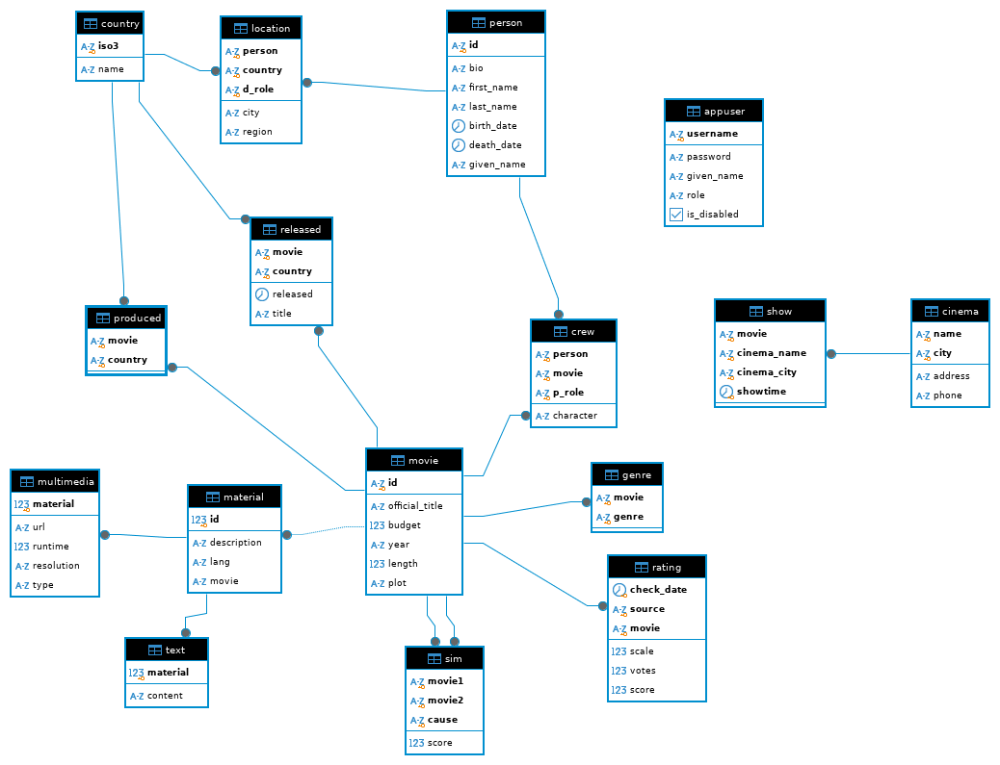

---
tags:
  - sql
  - postgres
  - postgresql
  - query
  - databases
  - italian
---
Structured Query Language

Linguaggio dichiarativo.

DDL: comandi per creare strutture per l'ossatura della base di dati (`CREATE TABLE`, `CREATE VIEW`, ...)<br />
DML: istruzioni (`INSERT`, `DELETE`, `UPDATE`, ...)<br />
DQL: `SELECT`<br />
DCL: comandi sul controllo

## Funzioni / operatori / clausole

* `lower` trasforma la stringa in lowercase
* `like` 
* `ilike` insensitive `like`
* `trim` rimuove gli spazi prima e dopo
* `ltrim` spazi a sinistra
* `rtrim` spazi a destra
* `between` ad esempio `... vote BETWEEN 1 and 10;`
* `in` ad esempio `... lower(genre) in ('drama', 'thriller', 'crime')`
* `distinct` 
	* ad esempio `SELECT DISTINCT movie FROM imdb.genre` (elimina i duplicati, rendendo il risultato "come fosse in algebra relazionale")
	* `SELECT DISTINCT movie, genre FROM imdb.genre` perché `DISTINCT` lavora sull'intera clausola `SELECT`
* `order by` ordina ciò che restituiamo, e' l'ultima cosa che viene fatta; si può specificare `DESC` per più attributi in base alle necessita'
  Si puo' fare `ORDER BY 2` per riferirsi alla colonna `2`
* `extract` permette di prendere parti di una data come ad esempio `WHERE extract(YEAR FROM birth_date) = '1971'`
* `as` e' l'equivalente di $\rho$ nell'algebra relazionale
* `::` e' l'operatore di cast `SELECT extract(year) from birth_date)::char(4) from imdb.person`
* `is null` unico modo per confrontare con `NULL`  
* `ALL` da true solo se il predicato e' verificato per tutti i valori restituiti dalla sotto query ad esempio nella seguente ammettendo che la sub-query ritornasse più valori, allora un record per poter essere restituito dovrebbe essere maggiore di tutti questi valori
```sql
SELECT id, official_title, length
FROM imdb.movie
WHERE length > ALL (
	SELECT length
	FROM imdb.movie
	WHERE official_title = 'Inception'
);
 ```
* `ANY` da true se il predicato e' verificato per almeno un valore restituito dalla sotto query
* `min/max` (agg)
* `avg` (agg)
* `sum` (agg)
* `count` (agg) cardinalità di una relazione
	* `COUNT(*)` conta tutte le righe
	* `COUNT(attributo)` conta le occorrenze in cui l'attributo non e' `NULL`, sempre bene contare su chiave esterna per essere sicuro che sia `NOT NULL`
* `group by` (agg) partizionare i record in base ad un criterio
* `having` filtra sul risultato del gruppo, quindi su operatori aggregati o sugli attributi del gruppo; come ottimizzazione e' meglio usare una `WHERE` prima di arrivare alla `GROUP BY` in modo da raggruppare su meno record, quindi e' sconsigliato usare la `HAVING` al suo posto

(agg) sono operatori di aggregamento, ignorano il `NULL`; vengono eseguiti alla fine; posso proiettare solo attributi aggregati o prodotti da un operatore di aggregamento.
Non si possono fare aggregati di aggregati.

La precedenza degli operatori logici viene valutata da sinistra verso destra, quindi
```sql
SELECT *
FROM imdb.movie
WHERE year '2010' OR length >= 60 AND length <= 120;
```

Prima valuta `year '2010' OR length >= 60` e poi il risultato di questa in `AND`.

`%` segnaposto per una stringa di qualsiasi lunghezza
`_` segnaposto per una stringa di lunghezza 1

## Prodotto cartesiano

```sql
SELECT *
FROM imdb.movie, imdb.produced
```

Cardinalità totale e' uguale a cardinalità movie (1033) per cardinalità produced (1332).

## Join

Sono una selezione sul prodotto cartesiano. 

```sql
SELECT *
FROM imdb.movie m, imdb.produced p
WHERE m.id = p.movie
```

`movie.id` chiave primaria, `produced.movie` chiave esterna.
Cardinalità e' uguale a cardinalità di produced.

Sintassi alternativa

```sql
SELECT m.id, m.official_title
FROM imdb.movie m 
INNER join imdb.produced p ON m.id = p.movie
WHERE country = 'USA'
```

`a JOIN b ON c` restituisce i record di `a` e `b` nel prodotto cartesiano che soddisfano `c`.

Eventuali `WHERE` vengono applicate dopo la `JOIN`!

## Join esterno (outer join)

Aggiunge al join eventuali record che non hanno alcuna corrispondenza nella tabella di destra (nel caso di `LEFT JOIN`).
Prima fa un `INNER JOIN` applicando le clausole `ON`, poi aggiunge i record spuri (che sono quelli della tabella "dall'altro lato" per cui non e' stato trovato un corrispondente).

Ad esempio per la richiesta "selezionare paesi nei quali non sono prodotti film":

```sql
SELECT c.iso3
FROM country c
LEFT JOIN produced p ON c.iso3 = p.country
WHERE p.country IS null
```


La cardinalità quindi include anche i record senza corrispondenza. 

`FULL JOIN` combina `LEFT` e `RIGHT`.

## Viste

Oggetti derivati formati a partire dai dati nelle tabelle, per offrire delle proiezioni dei dati tipicamente appartenenti a tabelle diverse.


```sql
CREATE VIEW movie_person as (
	SELECT *
	FROM movie 
	INNER JOIN crew on movie.id crew.movie
	INNER JOIN person on person.id = crew.person
)
```

A questo punto trovare le persone di inception diventa quanto segue.
Prima viene eseguita `movie_person` e poi viene eseguita la seconda query (nessuna duplicazione dei dati).

```sql
SELECT *
FROM movie_person
WHERE official_title ilike 'inception' AND p_role 'actor'
```

## Explain

Controllare i costi di una query, mostra l'albero di esecuzione della query. 
Si parte a leggere dalle foglie.

```sql
EXPLAIN ANALYZE ...
```

## Query correlata

Molto inefficiente
TODO espandere

## Query ricorsive

La tabella `sim` descrive similarità tra pellicole, la colonna `cause` spiega il motivo di questa similarità.

* Data una pellicola specifica suggerire le pellicole simili

Sono interessato alla pellicola `0013444`, le sono simili quelle che rispondono a 

```sql
SELECT movie2 FROM sim WHERE movie1 = '0013444'
```

Ma sono simili a `0013444` anche le pellicole simili a quelle restituite dalla query precedente, cioè se `0018756` e' restituito dalla query precedente, anche le query simili a `0018756` sono indirettamente simili a `0013444`.

Magari vorrei fermarmi ad una "distanza 3". Posso interpretare le pellicole come nodi, un arco e' presente se c'e' una relazione di somiglianza tra le due pellicole.

### Esempio base di query ricorsiva

```sql
WITH RECURSIVE t(n) AS (
	SELECT 1 
	UNION all 
	SELECT n+1 FROM t)
SELECT n FROM t
```

`t(n)` specifica che `n` e' il nome di cosa la query restituisce.
`SELECT 1` e' il passo base, `SELECT n+1 FROM t` e' il passo ricorsivo.

Tutte le query ricorsive quindi seguono questo schema, con la `UNION` tra i due passi.

`UNION ALL` rimuove duplicati, `UNION` li tiene.

Il problema di questa query e' che non si ferma mai, quindi ne limitiamo l'esecuzione con la `WHERE`.

```sql

WITH RECURSIVE t(n) AS (
	SELECT 1 
	UNION all 
	SELECT n+1 FROM t WHERE n < 10)
SELECT n FROM t
```

La differenza tra `UNION` e `UNION ALL` e' nella gestione dei duplicati, la seconda gestisce anche i duplicati.

### Altro esempio

Supponiamo di essere interessati ad una organizzazione dei generi che sia gerarchica.

```sql
CREATE TABLE genre_taxonomy {
  genre_name VARCHAR PRIMARY KEY,
  genre_parent VARCHAR
}
ALTER TABLE genre_taxonomy 
ADD CONSTRAINT parent_fk FOREIGN KEY (genre_parent)
REFERENCES genre_taxonomy(genre_name)

```

Serve `ALTER TABLE` perché e' un riferimento alla tabella stessa, quindi va prima creata la tabella, e poi si può introdurre la foreign key.

Relazione 1 a N:

* 1 perché preso un sotto-genere ha sempre e solo 1 padre
* N perché preso un sopra-genere può avere N figli

```
- thriller
	- noir
		- poliziesco
			- spionaggio
			- cronaca nera
	- splatter
```

Restituire i generi di 'poliziesco'

```sql
WITH RECURSIVE search_parent(the_genre, parent_genre) AS (
	SELECT genre_name, genre_parent
	FROM genre_taxonomy
	WHERE genre_name = 'poliziesco'
	union
	SELECT sp.the_genre, gt.genre_parent -- nota gli stessi nomi dei parametri
	FROM search_parent sp 
	JOIN genre_taxonomy gt ON sp.genre_parent = gt.genre_name
)

SELECT * FROM search_parent
```

Si ferma grazie al `JOIN` che non produce una riga quando trova un `NULL` nella sua condizione di `ON`.

Restituire i primi due generi di 'poliziesco', quindi mi fermo "prima di arrivare in cima"

Aggiungo un parametro `distance`

```sql
WITH RECURSIVE search_parent(the_genre, parent_genre, distance) AS (
	SELECT genre_name, genre_parent, 1
	FROM genre_taxonomy
	WHERE genre_name = 'poliziesco'
	union
	SELECT sp.the_genre, gt.genre_parent, sp.distance + 1
	FROM search_parent sp 
	JOIN genre_taxonomy gt ON sp.genre_parent = gt.genre_name
	WHERE distance < 1
)

SELECT * FROM search_parent
```

### Riprendendo sulle pellicole simili

```sql
WITH RECURSIVE search_sim(movie, t_movie, distance) AS(
	SELECT movie1, movie2, 1
	FROM sim
	WHERE movie1 = '0013444'
	UNION
	SELECT ss.movie, si.movie2, distance + 1
	FROM search_sim ss 
	JOIN sim si ON ss.s_movie = si.movie1
	WHERE distance < 3
)
```

---
## Esercizi



* Selezionare il titolo delle pellicole del 2010
```sql
SELECT official_title
FROM imdb.movie 
WHERE year = '2010';
```

* Cercare pellicole che hanno "murder" nel titolo
```sql
SELECT *
FROM imdb.movie
WHERE official_title LIKE '%murder%'
```

* Trovare le pellicole prodotte in due paesi diversi
```sql
SELECT *
FROM imdb.produced p1, imdg.produced p2
WHERE p1.movie = p2.movie AND p1.country <> p2.country
```

Pero' in questo caso ottengo duplicati, quindi dovrei rimuoverli, posso risolvere usando il `<`

```sql
SELECT p1.movie, p1.country as country1, p2.country as country2
FROM imdb.produced p1, imdg.produced p2
WHERE p1.movie = p2.movie AND p1.country < p2.country
```

* Persone decedute in un paese diverso da quello di nascita

```sql
SELECT *
FROM location l1, location l2
WHERE l1.person = l2.person AND
	l1.d_role <> l2.d_role AND l1.country <> l2.country
```

Ma se la lascio cosi ha duplicati, per rimuoverli uso

```sql
SELECT *
FROM location l1, location l2
WHERE l1.person = l2.person AND
	l1.d_role = 'B' AND l2.d_role = 'D' AND
	l1.country <> l2.country
```

* Trovare le pellicole che non hanno materiali

```sql
SELECT movie.id
FROM movie

EXCEPT

SELECT DISTINCT material.movie
FROM material
```

* Trovare le pellicole che sono prodotte in ITA e USA

La seguente e' sbagliata! Scorre la tabella produced cercando un record che contemporaneamente abbia country `'ITA'` e `'USA'`

```sql
SELECT *
FROM produced 
WHERE country = 'ITA' AND country = 'USA'
```

Viene semplicissimo con l'intersezione occhio a non usare `*` perché in un caso filtriamo country con `ITA` e nell'altro con `USA` quindi saranno sempre diversi, quindi mai intersecabili

```sql
SELECT movie FROM produced WHERE country = 'ITA'
INTERSECT
SELECT movie FROM produced WHERE country = 'USA'
```

* Trovare i titoli delle pellicole prodotte in ITA e USA

```sql
SELECT id, official_title
FROM produced JOIN movie ON movie = id 
WHERE country = 'ITA'
INTERSECT
SELECT id, official_title
FROM produced JOIN movie ON movie = id 
WHERE country = 'USA'
```

Metto anche `id` nella `SELECT` per avere una intersezione solo quando anche l'`id` (che e' chiave) e' uguale, altrimenti potrei avere duplicati.

Posso farlo anche con una CTE <label class="sidenote-toggle sidenote-number"></label>.
<span class="sidenote">Common Table Expressions</span>

```sql
WITH mp AS (
	SELECT * FROM produced INNER JOIN movie ON movie = id
)
SELECT id, official_title FROM mp WHERE country = 'ITA'
INTERSECT
SELECT id, official_title FROM mp WHERE country = 'USA'
```

Il beneficio e' creare un oggetto in memoria, temporaneo.
Utile quando ho bisogno di diversi componenti.

Oppure ancora

```sql
SELECT id, official_title FROM movie WHERE  id IN (
	SELECT movie FROM produced WHERE country = 'ITA'
	INTERSECT
	SELECT movie FROM produced WHERE country = 'USA'
)
```

Oppure ancora con self join (che e' anche un razzo)

```sql
SELECT usa.movie
FROM produced usa 
JOIN produced ita ON usa.movie = ita.movie
JOIN movie ON usa.movie = id
WHERE usa.country = 'USA' AND ita.country = 'ITA'
```

* Trovare titolo dei film con durata superiore alla durata di inception

La seguente non va bene senza `ANY` perché potrei avere più risultati dalla inner query

```sql
SELECT id, official_title, length
FROM imdb.movie
WHERE length > ANY (
	SELECT LENGTH
	FROM imdb.movie
	WHERE official_title = 'Inception'
)
```

O anche

```sql
SELECT DISTINCT m1.id, m1.official_title
FROM movie m1 JOIN movie m2
ON m1.length > m2.length
WHERE m2.official_title = 'Inception'
```

TODO e' possibile usare SELF JOIN per emulare il comportamento della ALL? 

* Trovare le pellicole prodotte solo in Italia

```sql
SELECT p.movie
FROM produced p
WHERE p.country = 'ITA' AND movie NOT IN (
	SELECT movie
	FROM produced
	WHERE country <> 'ITA'
)
```

Oppure con la sottrazione

```sql
SELECT movie FROM produced WHERE country = 'ITA'
EXCEPT 
SELECT movie FROM produced WHERE country <> 'ITA'
```

Oppure con join esterno

```sql
WITH itamovies AS (
	SELECT p.movie
	FROM produced p
	WHERE p.country = 'ITA'
),
nonitamovies AS (
	SELECT movie 
	FROM produced
	WHERE country <> 'ITA'
)
SELECT *
FROM itamovies LEFT JOIN nonitamovies ON itamovies.movie = nonitamovies.movie
WHERE nonitamovies.movie IS NULL
```

Oppure senza `WITH`

```sql
SELECT DISTINCT itamovies.*
FROM produced itamovies
LEFT JOIN produced nonitamovies ON itamovies.movie = nonitamovies.movie AND nonitamovies.country <> 'ITA'
WHERE itamovies.country = 'ITA' AND nonitamovies.movie IS NULL
```

* Trovare il titolo di tutti i film con relativi generi

La seguente non troverebbe i film che non hanno genere

```sql
SELECT id, official_title, genre
FROM movie 
JOIN genre ON movie.id = genre.movie
```

quindi

```sql
SELECT id, official_title, genre
FROM movie
LEFT JOIN genre ON movie.id = genre.movie
```

* Per ogni persona mostrare il nome e il country dove e' deceduto, incluse le persone per le quali non abbiamo un country di decesso

```sql
SELECT id, given_name, country
FROM person 
LEFT JOIN location ON person.id = location.person
WHERE d_role = 'D'
```

La `WHERE` viene valutata sull'effetto del `JOIN`, quindi lo annulla, perché per i record spuri `d_role` sarebbe `NULL`, quindi la query non e' corretta perché non aggiunge i `NULL`.

Possibile soluzione in cui filtriamo prima 

```sql
WITH deaths AS (
	SELECT *
	FROM location l
	WHERE d_role = 'D'
)
SELECT id, given_name, country
FROM person 
LEFT JOIN deaths ON person.id = deaths.person
```

Oppure imponiamo il filtro nel momento del join

```sql
SELECT id, given_name, country
FROM person 
LEFT JOIN location ON person.id = location.person AND d_role = 'D'
```

* Trovare coppie di pellicole che non hanno generi in comune

"Da tutte le possibili combinazioni, togliamo le pellicole che hanno un genere in comune"

```sql
SELECT DISTINCT g1.movie, g2.movie
FROM genre g1 JOIN genre g2 ON g1.movie > g2.movie
except
SELECT DISTINCT g1.movie, g2.movie
FROM genre g1 JOIN genre g2 ON g1.movie > g2.movie
WHERE g1.genre = g2.genre
```

oppure (notare l'uso di `c` nella [Query correlata](SQL.md#Query%20correlata))

```sql
WITH couples as (
	SELECT DISTINCT g1.movie AS movie1, g2.movie AS movie2
	FROM genre g1 JOIN genre g2 ON g1.movie > g2.movie
)
SELECT * 
FROM couples c
WHERE NOT EXISTS (
	SELECT * ;; irrilevante cosa abbiamo qui
	FROM genre g1, genre g2
	WHERE g1.movie = c.movie1 AND g1.movie = c.movie2 AND g1.genre = g2.genre
)
```

* Trovare i film che non sono stati distribuiti nei paesi nei quali sono stati prodotti

Tabelle interessate: produced e released

Un movie `m` viene inserito nel risultato se non esiste un record della tabella produced `p` per il quale esiste un record di release relativo allo stesso movie e paese di `p` 

```sql
SELECT id, official_title
FROM movie m
WHERE NOT EXISTS (
	SELECT *
	FROM produced p
	WHERE p.movie = m.id AND EXISTS (
		SELECT *
		FROM released r
		WHERE r.movie = m.id AND p.country = r.country
	)
)
```

Utile quando devo contemporaneamente far valere più vincoli. Con gli operatori insiemistici non me la cavo perché devo controllare le condizioni su ogni singolo record. TODO ESPANDERE Con esempio e spiegazione

Oppure

```sql
SELECT id, official_title
FROM movie m
WHERE NOT EXISTS (
	SELECT *
	FROM produced p JOIN released r ON p.movie = r.movie AND 
		p.country = r.country
	WHERE p.movie = m.id
)
```

* Trovare il film di durata maggiore

```sql
SELECT max(length)
FROM movie
```

* Trovare il film di durata maggiore e restituire il titolo

La seguente va in errore perché nell'aggregare perdono il riferimento alla tupla che contiene quel valore, inoltre potrei avere più di un record con quel valore, quindi devo aggregare tutto ciò che voglio selezionare

```sql
SELECT id, official_title, max(length) FROM movie
```

Un modo per farlo e'

```sql
SELECT * FROM movie WHERE length = (
	SELECT MAX(length) as durata_massima FROM movie
)
```

Oppure anche

```sql
WITH mmax AS (
	SELECT MAX(length) as durata_massima FROM movie
)
SELECT m.* 
FROM movie JOIN mmax ON m.length = mmax.durata_massima
```

* Trovare il numero di pellicole per le quali e' noto l'anno di produzione

Non serve specificare `WHERE year IS NOT NULL` (vedi descrizione `COUNT`)

```sql
SELECT count(year) FROM movie
```

Invece cosi serve

```sql
SELECT COUNT(*) FROM MOVIE WHERE year IS NOT NULL
```

* Trovare il numero di titoli diversi delle pellicole

```sql
SELECT COUNT(DISTINCT official_title) FROM movie
```

* Trovare la durata media dei film del 2010

```sql
SELECT sum(length) / count(length)
FROM movie
WHERE year = '2010'
```

* Trovare il numero di pellicole per ogni anno disponibile

Conteggia in base ad ogni gruppo trovato dalla `GROUP BY`

```sql
SELECT year, COUNT(*)
FROM movie
GROUP BY year
```

* Trovare per ciascun film il numero di persone coinvolte per ciascun ruolo

```sql
SELECT COUNT(*)
FROM crew
GROUP BY movie, c.p_role
```

* Trovare il numero di valutazioni per ogni film

La seguente pero' non tiene conto delle pellicole senza valutazioni, perché dentro `rating` ho solo pellicole già valutate

```sql
SELECT movie, COUNT(*) 
FROM rating
GROUP BY movie
```

La seguente produce il risultato atteso ma e' convoluta

```sql
SELECT movie, COUNT(*)
FROM ratingGROUP BY movie
UNION
(
	SELECT id, 0
	FROM movie
	EXCEPT 
	SELECT movie, 0
	FROM rating
)
```

Nella seguente occhio a non usare `COUNT(*)` perché altrimenti conterebbe le righe, invece usando `COUNT(r.movie)` conteggio quando la riga non e' spuria.

```sql
SELECT movie, COUNT(r.movie)
FROM movie m LEFT JOIN rating r ON m.id = r.movie
GROUP BY id
```

* Trovare il miglior rating di ciascun film

```sql
SELECT movie, MAX(score / scale)
FROM movie m LEFT JOIN rating r on movie.id = rating.movie
GROUP BY id
ORDER BY 2 DESC
```

* Trovare l'attore che ha recitato nel maggior numero di film

`MAX(COUNT(*))` non si può fare.

La seguente e' sbagliata, perché potrebbero esserci più record con il valore massimo.
`DISTINCT MOVIE` per rimuovere attori con più di un ruolo nello stesso film.

```sql
SELECT person, COUNT(DISTINCT movie)
FROM crew
WHERE p_role = 'actor'
GROUP BY person
ORDER BY 2 DESC
LIMIT 1
```

Soluzione

```sql
WITH recitazioni AS (
	SELECT person, COUNT(DISTINCT movie) AS n_partecipazioni
	FROM crew
	WHERE p_role = 'actor'
	GROUP BY person
)
SELECT id, given_name, n_partecipazioni
FROM person p JOIN recitazioni r ON p.id = r.person
WHERE n_partecipazioni = (
	SELECT MAX(n_partecipazioni) AS max_partecipazioni
	FROM recitazioni)
```

Soluzione alternativa

```sql
SELECT person, COUNT(DISTINCT movie) AS n_partecipazioni
FROM crew
WHERE p_role = 'actor'
GROUP BY person
HAVING COUNT(DISTINCT movie) >= ALL (
	SELECT COUNT(DISTINCT movie)
	FROM crew
	WHERE p_role = 'actor'
	GROUP BY person
)
```

* Trovare i film con cast più numeroso della media dei film del medesimo genere

```sql
WITH movie_cast AS (
	SELECT movie, COUNT(DISTINCT person) AS n_person
	FROM crew
	WHERE p_role in ('actor', 'director')
	GROUP BY movie
),
avg_genre AS (
	SELECT genre, AVG(n_person) as avg_cast
	FROM movie m LEFT 
	LEFT JOIN genre g ON m.id = g.movie 
	LEFT JOIN movie_cast mc ON m.id = mc.movie
	GROUP BY genre
)
SELECT m.id, official_title, g.genre, n_person
FROM movie m
LEFT JOIN genre g ON m.id = g.movie
LEFT JOIN movie_cast mc ON m.id = mc.movie
WHERE mc.n_person > (
	SELECT avg_cast 
	FROM avg_genre 
	WHERE g.genre = avg_genre.genre 
)
```

* Trovare le persone che hanno recitato in tutti i film di genere crime (divisione)

Tabelle utili
$$
\begin{align}
&\ crew(person,\ movie) \newline
&\ genre(movie,\ genre) \newline
\end{align}
$$

In algebra e'
$$
\begin{align}
&\ A = \pi_{(person,movie)} crew \newline
&\ B = \pi_{movie}(\sigma_{genre='Crime}) \newline
&\ A / B \newline
\end{align}
$$

```sql
SELECT id, given_name
FROM person p
WHERE NOT EXISTS (
	SELECT *
	FROM genre g
	WHERE g.genre = 'Crime' AND NOT EXISTS (
		SELECT *
		FROM crew c
		WHERE p_role = 'actor' AND p.id = c.person AND g.movie = crew.movie
	)
)
```


* Restituire le persone che hanno svolto più di un ruolo all'interno dello stesso team

Questa prima query e' in grado di dire quali ruoli e la persona ha svolto e in che film...

```sql
SELECT DISTINCT c1.person, c1.p_role, c2.p_role, c1.movie
FROM crew c1
JOIN crew c2 ON c1.person = c2.person
WHERE c1.p_role <> c2.p_role AND c1.movie = c2.movie
ORDER BY c1.person
```

...mentre questa query e' in grado di dire che la data `person` ha svolto più ruoli all'interno del film, ma non sa dire quali per via dell'aggregazione che fa perdere informazione; per contro questa query e' più performante della precedente

```sql
SELECT person, movie
FROM crew
GROUP BY movie, person
HAVING COUNT(DISTINCT p_role) > 1;
```

* Trovare i film che hanno un cast più numeroso della media

`ANY` e' opzionale nel caso di un solo record ritornato

```sql
WITH cast_crew_num AS (
	SELECT movie, COUNT(*)
	FROM crew
	GROUP BY movie
),
mean AS (
	SELECT AVG(count) AS m
	FROM cast_crew_num
)

SELECT *, (SELECT m FROM mean)
FROM cast_crew_num
WHERE count > (SELECT m FROM mean)
```


