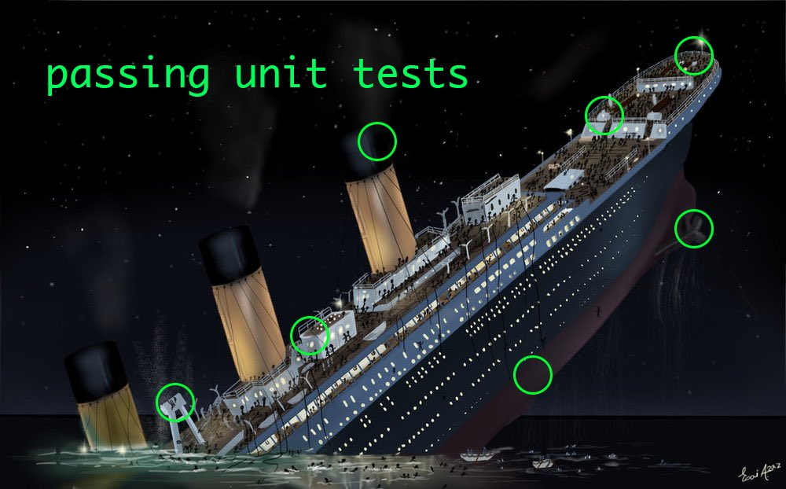

---
tags:
  - software-engineering
  - italian
---
Domande 

- * cosa e' un test ideale? (+)
* perche' TDD e' una buona tecnica? Tecnica di requisiti o tecnica di design o di progettazione? Cos'e'? (+)
- quando un criterio di selezione è valido e quando è affidabile
- terminologia degli errori
- albero di copertura vs abero di raggiungibilità
- criteri di selezione: proprietà
- Terminologia di base di verifica e convalida. Sbaglio, errore, difetto, anomalia…, esempio in cui si presenta anomalia ma non (difetto o errore (?))


# Definizione

> TDD is an awareness of the gap between decision and feedback during programming, and techniques to control that gaps
<cite>-- Kent Beck</cite>

The gap is the time between when a decision is made and when you get if it was correct. In traditional development this gap could be huge, which makes debugging difficult and costly.

Techniques:

* write tests before implementation code
* work in very small increments ([Red green refactor cycle](TDD.md#Red%20green%20refactor%20cycle))
* getting rapid feedback on each decision
* making course correction while the context is fresh in your mind

So TDD could be thought as a feedback mechanism.

Shrinking the gap allows to reduce decision fatigue and technical debt, as the latter could be expressed as decisions made without proper feedback.

## Quotes

> TDD e' una metodologia di sviluppo software, non di testing

> Testing shows the presence, not the absence of bugs.
<cite>-- Dijkstra</cite>

This quote comes from [here](http://homepages.cs.ncl.ac.uk/brian.randell/NATO/nato1969.PDF)

> Write tests until fear is transformed into boredom

TDD = test first + baby steps


# Verifica e convalida

Vedere [Verifica e convalida](Verifica%20e%20convalida.md) per
* definizione di test affidabile e valido
* criteri di selezione di test

# Test

SUT is the subject under test, [there can be only one](https://highlander.fandom.com/wiki/There_can_be_only_one) SUT for a single test and it is never mocked.
DOC is the dependent on component, there can be many and they have to be mocked.

Si possono evitare di mockare:

* enum
* lambda

# Red green refactor cycle

<span class="sidenote">Failure is progress</span>

Ask myself: "What set of tests, when passed, will demonstrate the presence of code we are confident will compute as expected?"

The rhythm of TDD (Red Green Refactor Red Green ...):
* quickly add a test
* run <span class="b">all</span> tests and see the new one fail
* make a little change
* run <span class="b">all</span> tests and se them all succeed
* refactor to remove duplication

](Pasted%20image%2020250309154057.png)

If in need to have a test go red use the triangulation technique, for example suppose the first expectation was the only one then we add the second:

```language-java
public void testEquality() {
  assertTrue(new Dollar(5).equals(new Dollar(5)));
  assertTrue(new Dollar(5).equals(new Dollar(6))); // triangulation
}
```

Per ogni test ci deve essere una sola esecuzione del metodo che sto testando, cosi che quando qualcosa fallisce so esattamente dove andare a guardare, e non ci sono test che "falliscono a meta'".

## Refactoring

Modifiche del codice senza cambiare funzionalita', per modificare qualche qualita' interna, avviene dopo il Green perche' se ottengo un Red dopo un Refactoring sono nell'incertezza.

Continuare a fare refactoring senza pieta'. Perche' per farlo ci vuole coraggio: "Scrivo il test e tra 5 10 minuti il test passa"

Non ci può essere un refactoring se non si parte da Green.
Nei refactoring non si possono modificare funzionalità.

## Tempo

Un rosso deve essere ragionevolmente breve, indicativamente minore di 10' - 15'.
Trovarsi bloccati in questa fase puo' voler dire che si e' approcciato un problema troppo difficile, trovare una via piu' semplice.

# Test double

The notion comes from "stunt double" used in movies.

[Test double](http://xunitpatterns.com/Test%20Double.html) - controfigura per il testing: si mette al posto di DOC per testare in isolamento il SUT; utile quando DOC:

* non esiste
* fornisce dati non deterministici / non prevedibili
* presentare situazioni difficilmente riproducibili (trasmissione, memoria, ...)
* e' lento
* potrebbe introdurre errori che non voglio considerare mentre testo SUT

## Mock vs Stub

[Quale e' la differenza tra un mock e uno stub?](https://martinfowler.com/articles/mocksArentStubs.html#TheDifferenceBetweenMocksAndStubs)

* dummy: oggetto passato ma su cui non si fa alcuna asserzione
* fake: possiede una implementazione funzionante, ma vive solo nel mondo dei test, ad esempio un database in memory per velocizzare i test

* assenza di mock: si sta facendo verificazione dello stato
* mock: verifica del comportamento ("questo metodo e' stato chiamato cosi?")
* stub: forniscono risposte preconfezionate, e rispondono solo a quelle (parto dal vuoto)
* spy: sono proxy di oggetti reali che consentono di loggarne le interazioni

## Utilizzo

Crea un oggetto. Dichiaro cosa voglio che questo oggetto sappia fare.

Instrumentano il DOC, instrumentati per essere interrogabili in merito a cosa gli e' successo: "chi ti ha chiamato?", "in che ordine?", "quante volte?", ...

```language-java
when(mockedObj.methodName(args)).thenXXX(values);
```

Per verificare quante volte un metodo viene chiamato

```language-java
verify(mockedClass, times(1)).methodName(args)
// oppure
ArgumentCaptor<Person> arg = ArgumentCaptor
	.forClass(Person.class);
verify(mock).doSomething(arg.capture());
assertEquals("John", arg.getValue().getName());
```

Per evitare di "consumare l'iteratore" si puo' utilizzare questo metodo di utilita':

```language-java
public static <T> void whenIter(Iterable<T> p, T... d) {
    when(p.iterator())
      .thenAnswer((Answer<Iterator<T>>) _ -> 
	      List.of(d).iterator());
}

```

Per mockare un costruttore 

```language-java
// si puo' passare a mockConstruction una serie di 
// parametri per mockare ad esempio eventuali altri 
// metodi che vengono usati nel costruttore di Tavolo
try (var mocked = Mockito.mockConstruction(Tavolo.class)) {
  Partita p = new Partita();
  Card c = mock();
  Tavolo t = mocked.constructed().getFirst();
  // ...
}

```

## Spy

Wrappa un oggetto reale. Dichiaro cosa voglio che non sappia fare (svuoto).

Se il soggetto e' l'oggetto under test allora
> stub : spy = riempire : svuotare

Meglio partire dal vuoto, cioe' stub.

# Testare metodi privati

Sono testati indirettamente, a fronte di chiamate dall'esterno.
Voglio poter cambiare i metodi privati senza troppo sforzo, in modo da fare refactor senza incorrere in grossi attriti.

Usare `extracting` quando si vuole testare una proprieta' privata, e 

```language-java
AssertionsForClassTypes.assertThat(player)
	.extracting("personalDeck", as(LIST))
	.containsExactly(Card.of("1B"), Card.of("2B"));
```

quando si sta testando una classe che implementa interfacce, perche' altrimenti l'`assertThat` "solito" non riesce a estrarre la proprieta'.

# Esporre variabili d'istanza / metodi

```language-java
var m = Game
	.class
	.getDeclaredMethod("distributeInitialCards");  
m.setAccessible(true);  
m.invoke(game);
```

Da farsi solo in test, perche' altrimenti a causa della reflection puo' rompere tutte le astrazioni.

# Patterns

Il codice duplicato e' anche dentro i test, non solo nel sorgente!

## Isolation

Good tests are written in isolation, so if one fails the rest will continue as if nothing happened: the idea is not to pollute a global state from which tests take their fixtures.

One broken test $\rightarrow$ one problem.
Two broken tests $\rightarrow$ two problems.

If tests are written in isolation then the order in which they're run does not matter.

## Test list

Ariadne's thread: Offload your brain list into a written one, on paper, jot down critical issues, pain points, etc... ; you don't want to put the list into tests right away, always follow the "climber rule": out of four among feet and hands always have at least three attached to the wall.

## Assert first

Write the assert first and then work your way upwards through the test.
This approach allows to concentrate on the goal and force the preconditions to come out almost on their own.

## Data

Make use of data to tell a clearer story, make your intentions evident. 
For example split whole numbers in elementary operations to make the reader aware of "where did that 372.68 come from?".

# Problema degli unit test



Sempre bene usare test di integrazione per asserire riguardo la correttezza del programma.

A volte puo' succedere che eseguendo un nuovo test (scommentato ad esempio come vediamo a laboratorio), questo passi senza aver seguito il red green refactor red etc.<span class="sidenote">Red green green ... wat?</span>
Vuol dire che magari la mia soluzione probabilmente ha implementato piu' del necessario.
Quindi vuol dire che non ho scritto la soluzione piu' semplice per far passare il test.

# LLM prompts

>   I want to make a learning exercise with you: I need to learn TDD for a university course, I want you to act like you're not into it and will try to push back, while I will try to convince you. Ready?
